# PhuQuocHub — Sơ đồ quan hệ thực thể (ERD tổng hợp)

> **Mục đích:** bức tranh toàn cảnh thực thể & quan hệ, hợp nhất từ [database.md](./database.md) và [modules/*](./modules/). ERD dưới đây **chỉ vẽ các thực thể đã phê duyệt và nhất quán**; các quan hệ đang mâu thuẫn hoặc phụ thuộc thực thể chưa phê duyệt được liệt kê ở §4 (chờ quyết định) — **không tự suy diễn**. Danh mục thực thể đầy đủ + trạng thái ở [database.md §11](./database.md).

## 1. Quy ước

- Đặt tên `snake_case`, bảng số nhiều; mỗi bảng có `id (UUID)` + `created_at/updated_at` (+ `deleted_at` khi soft delete).
- Ký hiệu Mermaid: `||--o{` một–nhiều · `||--||` một–một · `}o--o{` nhiều–nhiều.
- **Quan hệ đa hình** (`source_attributions`, `wiki_revisions`, `contacts`, `price_history`, `audit_logs`) không có FK cứng — biểu diễn bằng `entity_type`/`owner_type` + id. **Giá trị discriminator: `lowercase snake_case` thống nhất (B-3)** — vd `place, business, hotel, tour, event, review, post`; **không** UPPERCASE.
- **Exclusive arc** (`verifications`, `media`) dùng nhiều FK nullable + `CHECK` (không đa hình). `media` có **5 nhánh**: `place_id | review_id | post_id | business_id | event_id` (ADR-009).

## 2. ERD — thực thể đã phê duyệt & nhất quán

```mermaid
erDiagram
    users ||--o{ places : "created_by"
    users ||--o{ reviews : "writes"
    users ||--o{ contributions : "submits"
    users ||--o{ community_posts : "authors"
    users ||--o{ community_comments : "authors"
    users ||--o{ source_attributions : "verified_by"
    users ||--o{ user_roles : "assigned"
    roles ||--o{ user_roles : "granted_as"
    roles ||--o{ role_permissions : "grants"
    permissions ||--o{ role_permissions : "granted_by"
    roles ||--o{ role_parents : "child_of"
    roles ||--o{ role_parents : "parent_of"

    categories ||--o{ places : "classifies"
    categories ||--o{ categories : "parent_id"

    places ||--o{ reviews : "has"
    places ||--o{ contributions : "targets"
    places ||--o{ price_history : "entity=place (polymorphic)"
    places ||--o{ place_faqs : "has"
    places ||--|| place_seo : "has"
    places ||--|| place_ai_summary : "has"
    places ||--o{ wiki_revisions : "entity=place"
    places ||--o{ place_views_agg : "measured_by"
    places ||--o{ popular_places : "ranked_in"

    community_posts ||--o{ community_comments : "has"
    community_comments ||--o{ community_comments : "reply parent_id"

    places ||--o{ media : "place_id (exclusive arc)"
    reviews ||--o{ media : "review_id"
    community_posts ||--o{ media : "post_id"
    events ||--o{ media : "event_id (arc)"
    places ||--o{ contacts : "owner=place (polymorphic)"
    places ||--o| verifications : "place_id (arc)"
    contacts ||--o| verifications : "contact_id (arc)"
    price_history ||--o| verifications : "price_history_id (arc)"
    verifications ||--o{ verification_events : "audit trail"
    verifications ||--o{ verification_votes : "community ledger"
    users ||--o{ verification_votes : "casts"

    places ||--o{ business_claims : "claimed via"
    users ||--o{ business_claims : "requests"
    places ||--o{ business_members : "owned/managed"
    users ||--o{ business_members : "member of"
    business_claims ||--o{ business_members : "grants owner"

    sources ||--o{ source_attributions : "referenced_by"

    users ||--o{ audit_logs : "actor (soft FK)"
    %% audit_logs đa hình tới mọi entity qua entity_type/entity_id — KHÔNG FK cứng, KHÔNG cascade (bất biến)

    %% ---- Wave 2: Place Extension (satellite, ADR-002) ----
    places ||--|| place_hotel_details : "category=hotel"
    places ||--o{ hotel_room_types : "rooms"
    places }o--o{ amenities : "place_amenities"
    places ||--|| place_restaurant_details : "category=restaurant"
    places ||--o{ restaurant_menu_sections : "menu"
    restaurant_menu_sections ||--o{ restaurant_menu_items : "items"
    places }o--o{ cuisines : "place_cuisines"
    places ||--|| place_tour_details : "category=tour"
    places ||--o{ tour_stops : "itinerary"
    places ||--o{ tour_schedules : "departures"

    %% ---- Wave 2: Event (peer/Hybrid, KHÔNG phải Place extension) ----
    places ||--o{ events : "place_id (venue, nullable)"
    places ||--o{ events : "organizer_id (nullable)"
    users ||--o{ events : "created_by"
    events ||--o{ event_occurrences : "recurrence"

    place_views_agg }o..|| popular_places : "materialized"
    search_queries_agg }o..|| trending_keywords : "materialized"
```

## 3. Nhóm thực thể (theo domain)

| Nhóm | Thực thể | Nguồn |
|---|---|---|
| Người dùng & RBAC | `users`, `roles`, `permissions`, `role_permissions`, `role_parents`, `user_roles` | database.md §3.1 & §3.9–3.13, [rbac.md](../security/rbac.md) |
| Địa điểm & phụ trợ | `places`, `price_history` (polymorphic), `place_faqs`, `place_seo`, `place_ai_summary`, `media` (exclusive arc), `contacts` (polymorphic owner) | [places.md](./modules/places.md), database.md §3.5, §3.14, §3.15 |
| Nguồn & phiên bản | `sources`, `source_attributions`, `wiki_revisions` | [source.md](./modules/source.md) |
| Xác minh | `verifications` (exclusive arc), `verification_events` (audit), `verification_votes` (sổ phiếu) | [verification.md](./modules/verification.md), database.md §3.16–3.18 |
| Kiểm toán | `audit_logs` (append-only, đa hình, không cascade) | database.md §3.21, [ADR-016](../99-decisions/ADR-016-audit-log-model.md) |
| Mở rộng Place (Wave 2) | `place_hotel_details`, `hotel_room_types`, `amenities`, `place_amenities`, `place_restaurant_details`, `restaurant_menu_sections`, `restaurant_menu_items`, `cuisines`, `place_cuisines`, `place_tour_details`, `tour_stops`, `tour_schedules` | [places.md §13](./modules/places.md), [ADR-002](../99-decisions/ADR-002-place-extension.md) |
| Sự kiện (Wave 2, peer) | `events`, `event_occurrences` | database.md §3.22–3.23, [ADR-002](../99-decisions/ADR-002-place-extension.md) |
| Sở hữu cơ sở | `business_claims` (state machine), `business_members` (owner/manager) | [business.md](./modules/business.md), database.md §3.19–3.20, ADR-015 |
| Cộng đồng | `reviews`, `community_posts`, `community_comments`, `contributions` | database.md §3 |
| Thống kê | `page_views_agg`, `place_views_agg`, `search_queries_agg`, `popular_places`, `trending_keywords` | [analytics.md](./modules/analytics.md) |

## 4. Quan hệ CHỜ QUYẾT ĐỊNH (chưa vẽ)

Không đưa vào ERD §2 vì chưa nhất quán hoặc phụ thuộc thực thể chưa phê duyệt:

- **Ảnh/media:** đã chốt (**ADR-009**) — một bảng `media` **exclusive arc** (place/review/post/business), thay `place_media`; quan hệ **đã vẽ ở §2**.
- **Xác minh:** ✅ **đã chốt (ADR-008; hardening 2026-07-13)** — `verifications` (exclusive arc → places/contacts/price_history) + `verification_events` (audit trail) + `verification_votes` (sổ phiếu cộng đồng 1 người/phiếu) **đã vẽ ở §2**. Entity dùng cache `verification_status` + `verified_at` (**bỏ hoàn toàn `is_verified`**); transition có optimistic `lock_version` + gác RBAC.
- **Phiên bản:** ✅ **đã chốt (ADR-014)** — `wiki_revisions` (polymorphic) là thực thể phiên bản **duy nhất**; `place_revisions` **retire hoàn toàn** (chỉ còn ghi chú legacy, không còn tham chiếu hoạt động trong repo — B6). Quan hệ `places ||--o{ wiki_revisions` đã vẽ ở §2.
- **Place Extension:** ✅ **đã chốt (ADR-002/ADR-003 Accepted 2026-07-13)** — Hotel/Restaurant/Tour = satellite (1:1 details + 1:N children, FK thật, `category`-driven, **0 cột thêm `places`**); Event = peer/Hybrid (`events`/`event_occurrences`, `place_id` nullable). `media` arc mở rộng thêm `event_id`. **Đã vẽ ở §2.**

## 5. Ghi chú — bổ sung sau

- [x] **RBAC** (`roles`/`permissions`/`role_permissions`/`role_parents`/`user_roles`) đã thêm vào ERD §2 — thay `users.role` ENUM (**ADR-007 Accepted**).
- [x] **Media** (`media` exclusive arc: place/review/post/business) đã thêm vào ERD §2 — thay `place_media` (**ADR-009 Accepted**).
- [x] **Contacts** (`contacts` polymorphic owner_type/owner_id) đã thêm vào ERD §2 — thay cột liên hệ inline (**ADR-005 Accepted**).
- [x] **`places` đã hợp nhất (B7/ADR-001 Accepted):** [places.md §3](./modules/places.md) là định nghĩa authoritative **duy nhất**; database.md §3.3 chỉ tổng quan + quan hệ.
- [ ] (Tùy chọn) Vẽ ERD chi tiết kèm thuộc tính (attribute-level) khi cần cho Prisma review.
- [x] `contacts` (ADR-005) & `price_history` (ADR-006) đã phê duyệt — FK targets của Verification đã sẵn sàng.
- [x] Nhánh Verification (`verifications`/`verification_events`/`verification_votes`) **đã vẽ** vào ERD §2 (**ADR-008 Accepted**; enterprise hardening 2026-07-13); entity dùng cache `verification_status` + `verified_at` (bỏ `is_verified`).
- [x] Nhánh Business (`business_claims`/`business_members`) **đã vẽ** vào ERD §2 (**B8 Wave 1 / ADR-015 Accepted**, Place-centric). Gỡ FK treo: `media.business_id`, `contacts(owner=business)`, `user_roles.business_id` đều **→ places** (Place đã claim, provenance official).
- [x] Nhánh Kiểm toán (`audit_logs`) **đã vẽ** vào ERD §2 (**ADR-016 Accepted**, GAP-1 Trust Layer). Đa hình `entity_type/entity_id` (**không FK cứng, không cascade** — bất biến); chỉ FK mềm `actor_id → users`. Tầng audit hành chính/bảo mật, bổ sung `verification_events`/`wiki_revisions`/`source_attributions`.
- [x] Nhánh Mở rộng Place + Sự kiện (Wave 2, **ADR-002/003 Accepted**) **đã vẽ** vào ERD §2: 12 bảng satellite (Hotel/Restaurant/Tour, FK thật + cascade, `category`-driven) + `events`/`event_occurrences` (peer). `media` arc +`event_id`. `places` **không** thêm cột.
- [ ] Chiến lược biểu diễn quan hệ **đa hình** trong Prisma (Prisma không hỗ trợ FK đa hình gốc) — nay gồm cả `audit_logs`.

---

*Tài liệu liên quan: [database.md](./database.md), [modules/places.md](./modules/places.md), [modules/source.md](./modules/source.md), [modules/verification.md](./modules/verification.md), [modules/analytics.md](./modules/analytics.md)*
