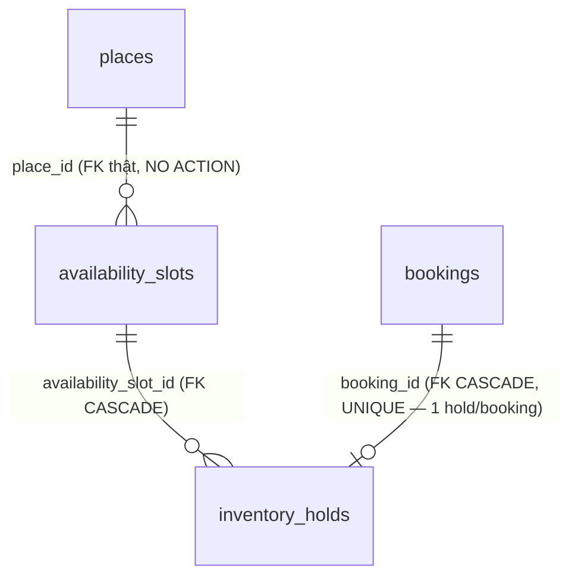

# PhuQuocHub — Thiết kế Database Module Availability & Inventory Foundation

> **Đã triển khai** (2026-07-30) — migration `InitAvailability`/`SeedAvailabilityPermissions`,
> module `apps/api/src/modules/availability/`. Tài liệu này mô tả ĐÚNG những gì đã tồn tại trong
> repo tại thời điểm viết, không phải một đề xuất. Xem
> [docs/delivery/reports/AVAILABILITY-AND-INVENTORY-FOUNDATION-2026-07-30.md](../delivery/reports/AVAILABILITY-AND-INVENTORY-FOUNDATION-2026-07-30.md)
> để biết lịch sử quyết định đầy đủ.
>
> Migration đã chạy thành công trên database dev sống (`npm run migration:show
> --workspace=apps/api` → `[X]`), và bộ e2e `bookings.e2e-spec` (14/14) pass sau khi áp dụng —
> xác nhận tích hợp Booking không hồi quy.

## 1. Phạm vi

Abstraction tồn kho/lịch trống **generic, đa hình, KHÔNG business logic riêng cho bất kỳ loại
hình nào** (hotel/restaurant/tour/event/transport) — dùng chung một schema, một service, một API
cho tất cả.

| Có | Không (ngoài phạm vi milestone này) |
|---|---|
| `availability_slots` (khung thời gian + tổng dung lượng) | payment, pricing engine |
| `inventory_holds` (giữ chỗ tạm thời, gắn 1-1 với booking) | notifications, invoices |
| Ngăn over-allocation dưới concurrency (row lock) | refunds, commissions, settlements |
| Lazy expiration (hold hết hạn không thể confirm) | customer accounts |
| Tích hợp additive/backward-compatible vào Booking | frontend |
| `GET`/`POST /availability-slots` (2 endpoint) | endpoint tạo/list hold độc lập — hold CHỈ tạo qua `POST /bookings` |
| | background sweep tự động expire (không có scheduler trong repo — xem §5) |

## 2. Vì sao domain MỚI, không tái dùng cột `capacity` sẵn có

Trước khi thiết kế, đã đọc trực tiếp `hotel_room_types.capacity` (`InitHotel`), `tour_schedules`
(tours.repository.ts — capacity theo từng ngày, không có tracking sống),
`place_transport_details.capacity_passengers`/`transport_service_options.capacity_passengers`
(transports.repository.ts) — **tất cả đều là metadata mô tả tĩnh** (per-room-type/per-schedule),
KHÔNG có khái niệm "đã đặt bao nhiêu / còn trống bao nhiêu" theo thời gian thực. Không có bảng
nào theo dõi tồn kho sống trong toàn bộ 5 module bookable hiện có. Do đó Availability là một
domain hoàn toàn mới, không sửa/tái dùng các cột `capacity` cũ (chúng vẫn giữ nguyên ý nghĩa mô
tả của mình, không đổi).

## 3. Sơ đồ quan hệ (ERD)

## 4. Bảng `availability_slots`

| Cột | Kiểu | Ghi chú |
|---|---|---|
| `id` | uuid PK | |
| `entity_type` | varchar(30) NOT NULL | `hotel\|restaurant\|tour\|event\|transport` — đa hình, ADR-003, không FK cứng |
| `entity_id` | uuid NOT NULL | Không FK cứng — cưỡng chế ở app |
| `place_id` | uuid NOT NULL, FK → `places(id)` ON DELETE NO ACTION | Neo Place lõi, cùng lý do như `bookings.place_id` |
| `slot_start` | timestamptz NOT NULL | |
| `slot_end` | timestamptz nullable | Không bắt buộc — một slot có thể là điểm thời gian đơn (vd giờ khởi hành tour) thay vì khung |
| `total_capacity` | int NOT NULL, CHECK > 0 | |
| `created_at`/`updated_at` | timestamptz | |

**Ràng buộc:** `UNIQUE (entity_type, entity_id, slot_start)` — một entity không thể có 2 slot
trùng giờ bắt đầu (tránh trùng lặp dữ liệu khi tạo nhiều lần).

**Index:** `(entity_type, entity_id)`, `(place_id)`, `(slot_start)`.

`held_quantity`/`remaining_capacity` KHÔNG phải cột lưu sẵn — tính động bằng
`SUM(inventory_holds.quantity)` (chỉ hold `active`+`confirmed`) tại thời điểm đọc
(`AvailabilitySlotsRepository.list`), tránh lệch dữ liệu (denormalized counter dễ drift).

## 5. Bảng `inventory_holds`

| Cột | Kiểu | Ghi chú |
|---|---|---|
| `id` | uuid PK | |
| `availability_slot_id` | uuid NOT NULL, FK → `availability_slots(id)` ON DELETE CASCADE | |
| `booking_id` | uuid NOT NULL, FK → `bookings(id)` ON DELETE CASCADE, UNIQUE | 1 hold/booking — không có booking nào giữ 2 slot khác nhau trong milestone này |
| `quantity` | int NOT NULL, CHECK > 0 | |
| `status` | enum `active\|expired\|released\|confirmed` DEFAULT `active` | |
| `expires_at` | timestamptz NOT NULL | |
| `created_at`/`updated_at` | timestamptz | |

**Index:** `(availability_slot_id)`, `(status)`.

**Lazy expiration — KHÔNG có background sweep.** Repo không có bất kỳ scheduling infra nào
(`@nestjs/schedule`, BullMQ, cron — đã grep xác nhận trống trong `package.json`). Thay vì thêm
một dependency mới ngoài scope milestone, expiration được kiểm tra **tại đúng thời điểm sử dụng**:
`AvailabilityService.confirmHoldForBooking` so `expiresAt <= now()` và ghi `status='expired'`
NGAY LÚC ĐÓ nếu đúng, rồi từ chối confirm — đảm bảo "expired hold không thể confirm" đúng 100%
dù không có sweep định kỳ. `InventoryHoldsRepository.expireOverdueHolds(now?)` cũng tồn tại như
một hàm bulk update độc lập (UPDATE ... WHERE status='active' AND expires_at <= now), sẵn sàng
được gọi bởi một scheduler thật khi repo có infra đó — nhưng KHÔNG có gì gọi nó tự động hiện tại.

## 6. Ngăn over-allocation dưới concurrency

`InventoryHoldsRepository.placeHold(manager, params)`:

1. `SELECT ... FOR UPDATE` (`setLock('pessimistic_write')`) khoá đúng dòng `availability_slots`
   đang giữ chỗ — chặn 2 request đồng thời đọc cùng lúc dung lượng còn trống rồi cả hai đều tưởng
   còn chỗ (race condition kinh điển).
2. `SUM(quantity)` các hold `active`+`confirmed` hiện có trên slot (COALESCE về 0 nếu chưa có
   hold nào).
3. Nếu `currentlyHeld + quantity > totalCapacity` → `ConflictException` (409), không insert hold.
4. Ngược lại → tạo hold `status='active'`.

Toàn bộ 4 bước trong CÙNG transaction (tham số `manager: EntityManager`, không tự mở transaction
riêng — xem §7). Test bao gồm: hết chỗ, đúng biên (`currentlyHeld + quantity === totalCapacity`),
chưa có hold nào (`currentlyHeld = 0`), và assertion tường minh `setLock` được gọi đúng
`'pessimistic_write'`.

## 7. Tích hợp Booking

Xem [docs/data/modules/booking.md §9](booking.md#9-availability--inventory-integration-2026-07-30)
cho chi tiết điểm nối — tóm tắt: `placeHold` nhận thẳng `EntityManager` của transaction
`BookingsRepository.create()` đang chạy (atomic với việc tạo booking+items); `confirm`/`cancel`
gọi `AvailabilityService.{confirmHoldForBooking,releaseHoldForBooking}` best-effort ở tầng
`BookingsService.transition()`.

## 8. API

| Method | Route | Permission | Ghi chú |
|---|---|---|---|
| GET | `/availability-slots` | `Availability.View` (role `moderator`+) | Filter entity_type/entity_id/place_id/date_from/date_to, pagination/sort theo convention `paginate()` hiện có. |
| POST | `/availability-slots` | `Availability.Manage` (role `moderator`+) | Tạo slot mới. |

Không có endpoint tạo/list hold độc lập — hold chỉ được tạo gián tiếp qua
`POST /bookings` (`availability_slot_id`, xem booking.md §9).

## 9. Permission mới (`SeedAvailabilityPermissions1720002800000`)

`Availability.View`/`Availability.Manage` — gán cho `moderator` (kế thừa tự động lên
`administrator`/`super_administrator` qua role DAG, `SeedRbac`'s `link()`). KHÔNG gán
`business_manager`/`business_owner` — cùng lý do như Booking (`business_claims`/
`business_members` Accepted trên giấy nhưng chưa migrate, 0 bảng DB sống).

## 10. Việc CHƯA làm (deferred, không phải quên)

- **Background sweep tự động expire** — xem §5, lazy expiration thay thế.
- **Endpoint tạo/list hold độc lập** — hold chỉ tạo qua booking creation.
- **Business-ownership-scoped management** — chỉ `moderator`+ platform-wide, xem §9.
- **Cập nhật/xoá availability slot** — chỉ có create + list, không update/delete trong scope này.
- **Frontend UI chọn slot khi đặt chỗ.**
- **Payment, pricing engine, notifications, invoices, refunds, commissions, settlements, customer
  accounts** — ngoài phạm vi milestone này, xem báo cáo delivery.

## Related

- [ADR-001](../../99-decisions/ADR-001-place-is-core.md), [ADR-003](../../99-decisions/ADR-003-no-polymorphic.md)
- [docs/data/modules/booking.md](booking.md) (§9 — điểm nối tích hợp)
- [docs/delivery/reports/AVAILABILITY-AND-INVENTORY-FOUNDATION-2026-07-30.md](../delivery/reports/AVAILABILITY-AND-INVENTORY-FOUNDATION-2026-07-30.md)
- [docs/api/openapi.yaml](../api/openapi.yaml) (tag `Availability`)
