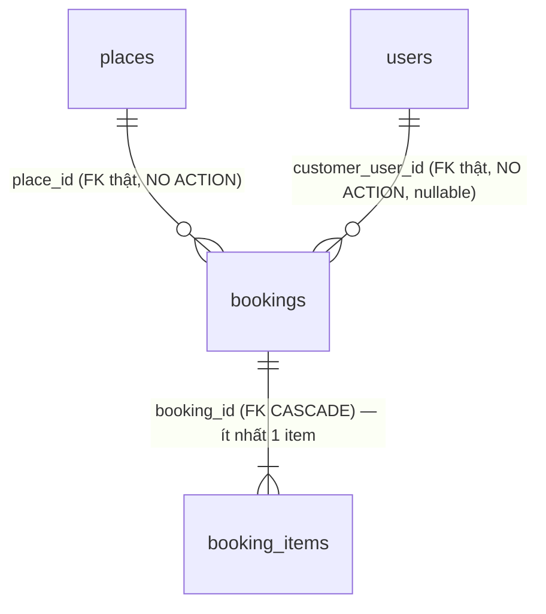

# PhuQuocHub — Thiết kế Database Module Booking (Booking Request Foundation)

> **Đã triển khai** (2026-07-29) — migration `InitBooking`/`SeedBookingPermissions`, module
> `apps/api/src/modules/bookings/`. Tài liệu này mô tả ĐÚNG những gì đã tồn tại trong repo tại
> thời điểm viết, không phải một đề xuất. Xem
> [docs/delivery/reports/MVP-BOOKING-FOUNDATION-2026-07-29.md](../delivery/reports/MVP-BOOKING-FOUNDATION-2026-07-29.md)
> để biết lịch sử quyết định đầy đủ.
>
> Migration đã được viết và test cấu trúc (mocked QueryRunner) nhưng **chưa từng chạy trên
> database sống** trong bất kỳ phiên nào (Docker không khả dụng trong môi trường phát triển này).
> Trước khi tin bất kỳ câu nào ở đây là "đang chạy thật", kiểm tra `\dt` trên database thật hoặc
> `npm run migration:show --workspace=apps/api`.

## 1. Phạm vi — Booking Request Foundation

Vertical slice nhỏ nhất khả thi: **tạo booking + tra cứu theo `booking_code`**. Không hơn.

| Có | Không (chưa xây, ngoài phạm vi slice này) |
|---|---|
| `bookings` + `booking_items` | availability confirmation (chưa kiểm tra tồn kho/lịch trống thật) |
| 3 trạng thái tách riêng (booking/payment/fulfillment) | pricing engine (giá là client-submitted, chưa xác nhận từ nhà cung cấp) |
| Tạo trong 1 transaction | payment processing (không có payment provider nào tích hợp) |
| `POST /bookings`, `GET /bookings/:bookingCode` | refunds, invoices, commissions, settlements |
| Khách hàng tối thiểu (`customer_user_id` → `users`) | booking_customers/booking_guests riêng, customer accounts mở rộng |
| | notifications (gửi email/SMS xác nhận) — `modules/notifications` vẫn `.gitkeep`-only |
| | frontend checkout (`apps/web` không có UI nào cho booking) |
| | admin/staff UI xem booking của người khác |

## 2. Nguyên tắc thiết kế (kế thừa từ places.md/ADR đã Accepted, không phát minh mới)

1. **entity_type/entity_id là tham chiếu đa hình, không FK cứng** — [ADR-003](../../99-decisions/ADR-003-no-polymorphic.md) ngoại lệ có kiểm soát (nhiều loại chủ: hotel/restaurant/tour/event/transport, tái dùng đa module), copy nguyên mẫu `price_history.entity_type/entity_id` ([ADR-006](../../99-decisions/ADR-006-price-history.md)).
2. **place_id là FK thật** → `places(id)`, `ON DELETE NO ACTION` — Place là thực thể lõi ([ADR-001](../../99-decisions/ADR-001-place-is-core.md)); không CASCADE vì booking là bản ghi tài chính/audit, không được biến mất ngầm nếu place bị xoá cứng (places thường soft-delete qua `deleted_at`).
3. **Không phụ thuộc Business ownership** (`business_claims`/`business_members`) — các bảng này Accepted trên giấy (ADR-015) nhưng **chưa migrate** (0 bảng DB sống), đúng tình trạng [ADR-017](../../99-decisions/ADR-017-transport-domain-foundation.md) (Transport) đã gặp và xử lý giống hệt: không có `business_id` nào trong `bookings`, chỉ `place_id`.
4. **Ba trạng thái tách riêng, không gộp** — `booking_status`/`payment_status`/`fulfillment_status` là ba khái niệm khác nhau (vòng đời yêu cầu đặt chỗ, vòng đời tiền, vòng đời giao/nhận dịch vụ thật).
5. **TRUST BOUNDARY về giá** — `unit_price` do client gửi trong request, KHÔNG có pricing engine nào xác nhận lại từ nhà cung cấp trong slice này. `subtotal`/`discount`/`fees`/`grand_total` là số tiền **yêu cầu/báo giá tại thời điểm đặt**, không phải giá cuối cùng đã xác nhận — phản ánh đúng bằng `booking_status='pending'` mặc định. `discount`/`fees` luôn `0` (chưa có discount/voucher engine).
6. **Không lộ database primary key qua API công khai** — response chỉ có `booking_code` (định danh công khai, unique, sinh ngẫu nhiên ~40-bit entropy, không tuần tự/không đoán được từ timestamp), không có `id` nội bộ.

## 3. Sơ đồ quan hệ (ERD)

## 4. Bảng `bookings`

| Cột | Kiểu | Ghi chú |
|---|---|---|
| `id` | uuid PK | Nội bộ — KHÔNG lộ ra API công khai |
| `booking_code` | varchar(20) UNIQUE | Định danh công khai — 8 ký tự, bảng chữ Crockford-rút gọn (bỏ `0/O/1/I/L`), ~39.6 bit entropy |
| `booking_type` | varchar(30) nullable | Chưa xác nhận taxonomy — NULL thay vì ENUM đoán giá trị |
| `entity_type` | varchar(30) NOT NULL | `hotel\|restaurant\|tour\|event\|transport` — đa hình, ADR-003 |
| `entity_id` | uuid NOT NULL | Không FK cứng — cưỡng chế ở app |
| `place_id` | uuid NOT NULL, FK → `places(id)` ON DELETE NO ACTION | Neo Place lõi |
| `customer_user_id` | uuid nullable, FK → `users(id)` ON DELETE NO ACTION | Khách hàng tối thiểu hoá — chỉ 1 cột tham chiếu, không bảng riêng |
| `currency_code` | char(3) DEFAULT 'VND' | ISO 4217 |
| `booking_status` | enum `pending\|confirmed\|cancelled\|expired` DEFAULT 'pending' | |
| `payment_status` | enum `unpaid\|paid\|refunded` DEFAULT 'unpaid' | Chỉ trạng thái — không có payment gateway đứng sau |
| `fulfillment_status` | enum `pending\|fulfilled\|no_show\|cancelled` DEFAULT 'pending' | |
| `service_start_at`/`service_end_at` | timestamptz nullable | `service_end_at` phải SAU `service_start_at` nếu cả hai cùng có (validate ở DTO) |
| `party_size` | int DEFAULT 1, CHECK > 0 | |
| `subtotal`/`discount`/`fees`/`grand_total` | numeric(12,2) DEFAULT 0 | Xem TRUST BOUNDARY §2.5 |
| `guest_note` | text nullable | Khách nhập, KHÔNG hiển thị lại cho ai khác ngoài chủ booking |
| `internal_note` | text nullable | Chỉ nội bộ — KHÔNG BAO GIỜ lộ qua API (kể cả `GET /bookings/:bookingCode`) |
| `created_at`/`updated_at` | timestamptz | |

**Index:** `(entity_type, entity_id)`, `(customer_user_id, created_at)`, `(place_id)`, `(booking_status)`, `(service_start_at)` (partial, `WHERE service_start_at IS NOT NULL`).

## 5. Bảng `booking_items`

Line item TRONG một booking (vd "2× vé người lớn", "3 đêm Deluxe") — KHÔNG phải giỏ hàng đa
nơi-bán; `entity_type`/`entity_id`/`place_id` ("cái gì được đặt") sống ở `bookings`, item chỉ là
dòng giá bên trong nó.

| Cột | Kiểu | Ghi chú |
|---|---|---|
| `id` | uuid PK | |
| `booking_id` | uuid NOT NULL, FK → `bookings(id)` ON DELETE CASCADE | |
| `label` | varchar(200) NOT NULL | Trim ở DTO |
| `quantity` | int DEFAULT 1, CHECK > 0 | |
| `unit_price` | numeric(12,2) DEFAULT 0 | TRUST BOUNDARY — xem §2.5 |
| `subtotal` | numeric(12,2) DEFAULT 0 | `quantity * unit_price`, tính ở service |
| `created_at` | timestamptz | |

**Index:** `(booking_id)`.

## 6. API

| Method | Route | Permission | Ghi chú |
|---|---|---|---|
| POST | `/bookings` | `Booking.Create` (role `member`) | Throttle 10/phút. Tạo booking + items trong 1 transaction — không có booking mồ côi 0 item. |
| GET | `/bookings/:bookingCode` | `Booking.View` (role `member`) | Throttle 30/phút. KHÔNG public — chỉ đúng chủ booking (`customer_user_id` khớp) mới xem được; 404 cho cả "không tồn tại" và "không phải của bạn" (không lộ tồn tại). Validate định dạng `bookingCode` trước khi chạm DB. |

Response (`BookingResponse`, xem `bookings.mapper.ts`) KHÔNG bao giờ chứa: `id` nội bộ,
`internal_note`, `customer_user_id`.

## 7. Việc CHƯA làm (deferred, không phải quên)

- **Availability confirmation** — không kiểm tra tồn kho/lịch trống thật trước khi tạo booking.
- **Pricing engine** — `unit_price` là client-submitted, chưa đối chiếu giá thật từ Hotel/Tour/…
- **Payment processing** — không có payment provider nào tích hợp (`payment_status` chỉ là cột trạng thái thủ công).
- **Refunds, invoices, commissions, settlements** — không có bảng/logic nào cho các domain group D/C.
- **Notifications** — không gửi email/SMS xác nhận (`modules/notifications` vẫn `.gitkeep`-only).
- **Customer accounts mở rộng** — không có `booking_customers`/`booking_guests`, chỉ 1 FK tới `users`.
- **Frontend checkout** — `apps/web` không có UI nào cho luồng đặt chỗ.
- **Admin/staff xem booking người khác** — chưa có scope/permission nào cho việc này.

## Related

- [ADR-001](../../99-decisions/ADR-001-place-is-core.md), [ADR-003](../../99-decisions/ADR-003-no-polymorphic.md), [ADR-006](../../99-decisions/ADR-006-price-history.md), [ADR-017](../../99-decisions/ADR-017-transport-domain-foundation.md)
- [docs/delivery/reports/MVP-BOOKING-FOUNDATION-2026-07-29.md](../delivery/reports/MVP-BOOKING-FOUNDATION-2026-07-29.md)
- [docs/api/openapi.yaml](../api/openapi.yaml) (tag `Bookings`)
