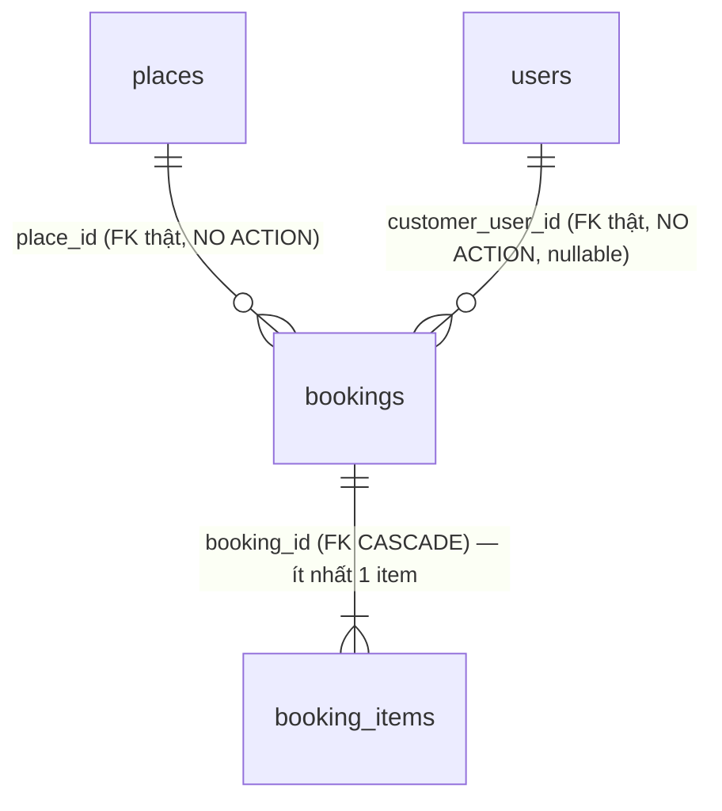

# PhuQuocHub — Thiết kế Database Module Booking (Booking Request Foundation + Application Layer + Availability/Inventory Integration)

> **Đã triển khai** (2026-07-29 Foundation, 2026-07-30 Application Layer/Phase 2,
> 2026-07-30 Availability & Inventory Integration) — migration
> `InitBooking`/`SeedBookingPermissions`/`AddBookingManagePermissions`/`InitAvailability`/
> `SeedAvailabilityPermissions`, module `apps/api/src/modules/bookings/` +
> `apps/api/src/modules/availability/`. Tài liệu này mô tả ĐÚNG những gì đã tồn tại trong repo tại
> thời điểm viết, không phải một đề xuất. Xem
> [docs/delivery/reports/MVP-BOOKING-FOUNDATION-2026-07-29.md](../delivery/reports/MVP-BOOKING-FOUNDATION-2026-07-29.md),
> [docs/delivery/reports/MVP-BOOKING-APPLICATION-LAYER-2026-07-30.md](../delivery/reports/MVP-BOOKING-APPLICATION-LAYER-2026-07-30.md)
> và
> [docs/delivery/reports/AVAILABILITY-AND-INVENTORY-FOUNDATION-2026-07-30.md](../delivery/reports/AVAILABILITY-AND-INVENTORY-FOUNDATION-2026-07-30.md)
> để biết lịch sử quyết định đầy đủ.
>
> **Phase 2 không thay đổi bảng `bookings`/`booking_items` hay bất kỳ migration đã phát hành nào**
> (`InitBooking`/`SeedBookingPermissions` giữ nguyên) — chỉ thêm MỘT migration mới
> (`AddBookingManagePermissions`, chỉ INSERT permission mới) và tầng application (query/update
> trạng thái/validation/event abstraction/audit) phía trên schema đã có.
>
> **Availability & Inventory Integration cũng không thay đổi bảng `bookings`/`booking_items` đã
> phát hành** — chỉ thêm 2 cột optional mới vào `CreateBookingRequestDto` (`availability_slot_id`,
> `hold_ttl_minutes`, đều nullable/optional, backward-compatible 100% với client cũ không gửi
> chúng) và 2 bảng hoàn toàn mới (`availability_slots`/`inventory_holds`), xem §9.
>
> Tất cả migration ở trên đã chạy thành công trên database dev sống (xác nhận qua
> `npm run migration:show --workspace=apps/api` — toàn bộ hiện `[X]`) và bộ e2e `bookings.e2e-spec`
> (14/14) pass sau khi áp dụng.

## 1. Phạm vi — Booking Request Foundation

Vertical slice nhỏ nhất khả thi: **tạo booking + tra cứu theo `booking_code`**. Không hơn.

| Có | Không (chưa xây, ngoài phạm vi slice này) |
|---|---|
| `bookings` + `booking_items` | availability confirmation (chưa kiểm tra tồn kho/lịch trống thật) |
| 3 trạng thái tách riêng (booking/payment/fulfillment) | pricing engine (giá là client-submitted, chưa xác nhận từ nhà cung cấp) |
| Tạo trong 1 transaction | payment processing (không có payment provider nào tích hợp) |
| `POST /bookings`, `GET /bookings/:bookingCode` | refunds, invoices, commissions, settlements |
| Khách hàng tối thiểu (`customer_user_id` → `users`) | booking_customers/booking_guests riêng, customer accounts mở rộng |
| | notifications (gửi email/SMS xác nhận) — `modules/notifications` vẫn `.gitkeep`-only |
| | frontend checkout (`apps/web` không có UI nào cho booking) |
| | admin/staff UI xem booking của người khác |

## 2. Nguyên tắc thiết kế (kế thừa từ places.md/ADR đã Accepted, không phát minh mới)

1. **entity_type/entity_id là tham chiếu đa hình, không FK cứng** — [ADR-003](../../99-decisions/ADR-003-no-polymorphic.md) ngoại lệ có kiểm soát (nhiều loại chủ: hotel/restaurant/tour/event/transport, tái dùng đa module), copy nguyên mẫu `price_history.entity_type/entity_id` ([ADR-006](../../99-decisions/ADR-006-price-history.md)).
2. **place_id là FK thật** → `places(id)`, `ON DELETE NO ACTION` — Place là thực thể lõi ([ADR-001](../../99-decisions/ADR-001-place-is-core.md)); không CASCADE vì booking là bản ghi tài chính/audit, không được biến mất ngầm nếu place bị xoá cứng (places thường soft-delete qua `deleted_at`).
3. **Không phụ thuộc Business ownership** (`business_claims`/`business_members`) — các bảng này Accepted trên giấy (ADR-015) nhưng **chưa migrate** (0 bảng DB sống), đúng tình trạng [ADR-017](../../99-decisions/ADR-017-transport-domain-foundation.md) (Transport) đã gặp và xử lý giống hệt: không có `business_id` nào trong `bookings`, chỉ `place_id`.
4. **Ba trạng thái tách riêng, không gộp** — `booking_status`/`payment_status`/`fulfillment_status` là ba khái niệm khác nhau (vòng đời yêu cầu đặt chỗ, vòng đời tiền, vòng đời giao/nhận dịch vụ thật).
5. **TRUST BOUNDARY về giá** — `unit_price` do client gửi trong request, KHÔNG có pricing engine nào xác nhận lại từ nhà cung cấp trong slice này. `subtotal`/`discount`/`fees`/`grand_total` là số tiền **yêu cầu/báo giá tại thời điểm đặt**, không phải giá cuối cùng đã xác nhận — phản ánh đúng bằng `booking_status='pending'` mặc định. `discount`/`fees` luôn `0` (chưa có discount/voucher engine).
6. **Không lộ database primary key qua API công khai** — response chỉ có `booking_code` (định danh công khai, unique, sinh ngẫu nhiên ~40-bit entropy, không tuần tự/không đoán được từ timestamp), không có `id` nội bộ.

## 3. Sơ đồ quan hệ (ERD)



## 4. Bảng `bookings`

| Cột | Kiểu | Ghi chú |
|---|---|---|
| `id` | uuid PK | Nội bộ — KHÔNG lộ ra API công khai |
| `booking_code` | varchar(20) UNIQUE | Định danh công khai — 8 ký tự, bảng chữ Crockford-rút gọn (bỏ `0/O/1/I/L`), ~39.6 bit entropy |
| `booking_type` | varchar(30) nullable | Chưa xác nhận taxonomy — NULL thay vì ENUM đoán giá trị |
| `entity_type` | varchar(30) NOT NULL | `hotel\|restaurant\|tour\|event\|transport` — đa hình, ADR-003 |
| `entity_id` | uuid NOT NULL | Không FK cứng — cưỡng chế ở app |
| `place_id` | uuid NOT NULL, FK → `places(id)` ON DELETE NO ACTION | Neo Place lõi |
| `customer_user_id` | uuid nullable, FK → `users(id)` ON DELETE NO ACTION | Khách hàng tối thiểu hoá — chỉ 1 cột tham chiếu, không bảng riêng |
| `currency_code` | char(3) DEFAULT 'VND' | ISO 4217 |
| `booking_status` | enum `pending\|confirmed\|cancelled\|expired` DEFAULT 'pending' | |
| `payment_status` | enum `unpaid\|paid\|refunded` DEFAULT 'unpaid' | Chỉ trạng thái — không có payment gateway đứng sau |
| `fulfillment_status` | enum `pending\|fulfilled\|no_show\|cancelled` DEFAULT 'pending' | |
| `service_start_at`/`service_end_at` | timestamptz nullable | `service_end_at` phải SAU `service_start_at` nếu cả hai cùng có (validate ở DTO) |
| `party_size` | int DEFAULT 1, CHECK > 0 | |
| `subtotal`/`discount`/`fees`/`grand_total` | numeric(12,2) DEFAULT 0 | Xem TRUST BOUNDARY §2.5 |
| `guest_note` | text nullable | Khách nhập, KHÔNG hiển thị lại cho ai khác ngoài chủ booking |
| `internal_note` | text nullable | Chỉ nội bộ — KHÔNG BAO GIỜ lộ qua API (kể cả `GET /bookings/:bookingCode`) |
| `created_at`/`updated_at` | timestamptz | |

**Index:** `(entity_type, entity_id)`, `(customer_user_id, created_at)`, `(place_id)`, `(booking_status)`, `(service_start_at)` (partial, `WHERE service_start_at IS NOT NULL`).

## 5. Bảng `booking_items`

Line item TRONG một booking (vd "2× vé người lớn", "3 đêm Deluxe") — KHÔNG phải giỏ hàng đa
nơi-bán; `entity_type`/`entity_id`/`place_id` ("cái gì được đặt") sống ở `bookings`, item chỉ là
dòng giá bên trong nó.

| Cột | Kiểu | Ghi chú |
|---|---|---|
| `id` | uuid PK | |
| `booking_id` | uuid NOT NULL, FK → `bookings(id)` ON DELETE CASCADE | |
| `label` | varchar(200) NOT NULL | Trim ở DTO |
| `quantity` | int DEFAULT 1, CHECK > 0 | |
| `unit_price` | numeric(12,2) DEFAULT 0 | TRUST BOUNDARY — xem §2.5 |
| `subtotal` | numeric(12,2) DEFAULT 0 | `quantity * unit_price`, tính ở service |
| `created_at` | timestamptz | |

**Index:** `(booking_id)`.

## 6. API

| Method | Route | Permission | Ghi chú |
|---|---|---|---|
| GET | `/bookings` | `Booking.List` (role `moderator`+, Phase 2) | Query admin/staff — MỌI booking, không lọc theo chủ sở hữu. Pagination/sort/filter — xem §8.1. |
| POST | `/bookings` | `Booking.Create` (role `member`) | Throttle 10/phút. Tạo booking + items trong 1 transaction — không có booking mồ côi 0 item. |
| GET | `/bookings/:bookingCode` | `Booking.View` (role `member`) | Throttle 30/phút. KHÔNG public — chỉ đúng chủ booking (`customer_user_id` khớp) mới xem được; 404 cho cả "không tồn tại" và "không phải của bạn" (không lộ tồn tại). Validate định dạng `bookingCode` trước khi chạm DB. |
| POST | `/bookings/:id/confirm` | `Booking.Confirm` (role `moderator`+, Phase 2) | `pending` → `confirmed`. `:id` là uuid nội bộ (kênh đặc quyền), khác `bookingCode` công khai. |
| POST | `/bookings/:id/cancel` | `Booking.Cancel` (role `moderator`+, Phase 2) | `pending`\|`confirmed` → `cancelled`. |
| POST | `/bookings/:id/expire` | `Booking.MarkExpired` (role `moderator`+, Phase 2) | `pending` → `expired` (chỉ `pending` — một booking đã `confirmed` cần `cancel`, không "expire"). |

Response `GET /bookings/:bookingCode` (`BookingResponse`, xem `bookings.mapper.ts`) KHÔNG bao giờ
chứa: `id` nội bộ, `internal_note`, `customer_user_id` — **không đổi ở Phase 2**. Response
`GET /bookings` (`BookingAdminCardResponse`, kênh đặc quyền riêng) CÓ `id`/`customer_user_id`
(staff cần để thao tác/biết ai đặt) nhưng **vẫn KHÔNG BAO GIỜ** có `internal_note`.

## 7. Việc CHƯA làm (deferred, không phải quên)

- **Availability confirmation** — `availability_slot_id` là OPTIONAL (§9); một booking vẫn có thể
  tạo KHÔNG gắn slot nào (đúng hành vi cũ, không đổi). Chỉ khi client chủ động gửi
  `availability_slot_id` thì mới có kiểm tra tồn kho + giữ chỗ (hold) thật.
- **Pricing engine** — `unit_price` là client-submitted, chưa đối chiếu giá thật từ Hotel/Tour/…
- **Payment processing** — không có payment provider nào tích hợp (`payment_status` chỉ là cột trạng thái thủ công).
- **Refunds, invoices, commissions, settlements** — không có bảng/logic nào cho các domain group D/C.
- **Notifications thật** — domain event abstraction đã tồn tại (§8.3) nhưng KHÔNG gửi email/SMS
  thật (`modules/notifications` vẫn `.gitkeep`-only; `LoggingBookingEventPublisher` chỉ log).
- **Customer accounts mở rộng** — không có `booking_customers`/`booking_guests`, chỉ 1 FK tới `users`.
- **Frontend checkout / admin UI** — `apps/web` không có UI nào cho luồng đặt chỗ hay quản lý booking.
- **Business-ownership-scoped booking management** — `Booking.List`/`Confirm`/`Cancel`/
  `MarkExpired` (Phase 2) chỉ gán cho `moderator`+ (platform-wide), KHÔNG gán cho
  `business_manager`/`business_owner` vì `business_claims`/`business_members` vẫn chưa migrate
  (0 bảng DB sống) — không có cách nào cưỡng chế "chỉ booking CỦA CHÍNH cơ sở mình" nếu gán cho
  các role đó. Cần business ownership tables trước.
- **`BookingExpired` domain event** — KHÔNG có trong Phase 2 (chỉ yêu cầu Created/Confirmed/
  Cancelled); `markExpired` cập nhật DB + ghi audit nhưng không publish event nào.
- **Date-range filter theo `created_at`** — `GET /bookings` chỉ lọc theo `service_start_at`
  (§8.1); lọc theo ngày tạo booking có thể thêm sau nếu có nhu cầu thật.

## 8. Phase 2 — Booking Application Layer (2026-07-30)

### 8.1 Query (`GET /bookings`)

Pagination/response theo đúng convention hiện có của repo (`paginate()`,
`apps/api/src/common/pagination.ts` — `{success, data, meta: {timestamp, page, pageSize, total,
totalPages}}`), cùng khuôn `PlacesService.list()`.

Filter hỗ trợ: `booking_status`, `payment_status`, `fulfillment_status`, `module_code` (bí danh
của `entity_type` — cùng một cột DB, không thêm cột mới), `entity_type`, `date_from`/`date_to`.
**`date_from`/`date_to` lọc theo `service_start_at`, KHÔNG phải `created_at`** — bằng chứng:
`InitBooking1720002400000` đã tạo `idx_bookings_service_start` với chú thích "truy vấn quản trị
lọc theo mốc dịch vụ sắp tới ('booking trong 7 ngày tới')", tức "date range" ở đây được thiết kế
cho ngày DỊCH VỤ, không phải ngày TẠO booking.

Sort: `sort_by` giới hạn còn `created_at`/`service_start_at`/`grand_total` (không cho sort cột
tuỳ ý — tránh full-scan không kiểm soát), `sort_dir` mặc định `desc`.

### 8.2 Update (chỉ 3 hành động, không PATCH tuỳ ý)

`booking-status.transition.ts` — validation nghiệp vụ (FSM) TÁCH KHỎI controller/service, pure
function, unit-test độc lập không cần dựng service/DB:

```
pending    -> confirmed  (confirm)
pending    -> cancelled  (cancel)
pending    -> expired    (markExpired)
confirmed  -> cancelled  (cancel)
confirmed  -> *          KHÔNG hợp lệ khác cancel (đã confirmed thì không "confirm" lại,
                         không "expire" — expire chỉ cho yêu cầu CHƯA xác nhận)
cancelled  -> *          KHÔNG hợp lệ (trạng thái cuối)
expired    -> *          KHÔNG hợp lệ (trạng thái cuối)
```

Mọi thay đổi `booking_status` đi qua `BookingsService.{confirm,cancel,markExpired}` →
`transition()` (private, dùng chung) → `assertValidTransition` → `BookingsRepository.updateStatus`
→ `AuditService.record` (ADR-016, cùng khuôn `place.status_changed`) → publish domain event (nếu
có, xem §8.3). Không có endpoint hay code path nào update `booking_status`/`payment_status`/
`fulfillment_status` ngoài luồng này.

### 8.3 Domain events (abstraction only)

`events/booking-events.ts`: `BookingCreatedEvent`/`BookingConfirmedEvent`/`BookingCancelledEvent`
+ interface `BookingEventPublisher` + DI token `BOOKING_EVENT_PUBLISHER`.
`events/logging-booking-event-publisher.ts`: implementation mặc định — CHỈ log có cấu trúc
(`Logger.log`), KHÔNG gửi notification thật, KHÔNG tích hợp Kafka/RabbitMQ. Một adapter thật
(sprint sau) chỉ cần implement `BookingEventPublisher` và đổi provider trong `BookingsModule` —
KHÔNG cần sửa `BookingsService`.

Published tại: `create()` (BookingCreated), `confirm()` (BookingConfirmed), `cancel()`
(BookingCancelled). KHÔNG published tại `markExpired()` (không có `BookingExpired` event trong
yêu cầu Phase 2).

### 8.4 Audit

Dùng `AuditService` đã tồn tại (ADR-016, `core/audit/`) — KHÔNG tạo persistence mới. Ghi tại
`confirm`/`cancel`/`markExpired` (event `booking.status_changed`, `context: {from, to}`), KHÔNG
ghi cho `list`/`create`/`getByCodeForUser` (đọc, hoặc đã ghi vết đủ qua chính booking record).

### 8.5 Permission mới (`AddBookingManagePermissions1720002600000`)

`Booking.List`/`Booking.Confirm`/`Booking.Cancel`/`Booking.MarkExpired` — gán cho `moderator`
(kế thừa tự động lên `administrator`/`super_administrator` qua role DAG, `SeedRbac`'s `link()`).
KHÔNG gán `business_manager`/`business_owner` — xem §7.

## 9. Availability & Inventory Integration (2026-07-30)

Chi tiết schema/API của domain Availability (mới, độc lập, generic — không business logic riêng
cho hotel/tour/...) nằm ở tài liệu riêng:
[docs/data/modules/availability.md](availability.md). Phần này CHỈ mô tả điểm nối vào Booking.

### 9.1 DTO — 2 trường optional mới trên `CreateBookingRequestDto`

| Trường | Kiểu | Ghi chú |
|---|---|---|
| `availability_slot_id` | uuid v4, optional | Nếu có → booking sẽ cố gắng giữ chỗ (`quantity = party_size`) trên slot này trong CÙNG transaction tạo booking. Nếu không có → hành vi y hệt trước Integration (không hold nào được tạo). |
| `hold_ttl_minutes` | int 1–1440, optional | Thời gian sống của hold trước khi hết hạn. Mặc định `DEFAULT_HOLD_TTL_MINUTES = 30` (hằng số trong `bookings.service.ts`) nếu không gửi. |

### 9.2 Validate trước khi tạo (trong `BookingsService.create`, TRƯỚC khi gọi repository)

Nếu `availability_slot_id` có mặt:
1. Slot phải tồn tại (`AvailabilitySlotsRepository.findById`) — không thì `422`.
2. `slot.entityType`/`slot.entityId`/`slot.placeId` phải khớp CHÍNH XÁC với
   `entity_type`/`entity_id`/`place_id` của booking đang tạo — không thì `422` (chặn giữ chỗ nhầm
   slot của loại hình khác/place khác).
3. Nếu qua cả 2 bước trên, dựng `hold = { availabilitySlotId, quantity: party_size, expiresAt }`
   truyền xuống `BookingsRepository.create()`.

### 9.3 Tính nguyên tử (atomicity) — transaction dùng chung

`BookingsRepository.create()` đã có 1 transaction bọc insert `bookings` + `booking_items`.
`InventoryHoldsRepository.placeHold(manager, ...)` nhận THẲNG `EntityManager` của transaction đó
(không tự mở transaction riêng) → nếu giữ chỗ thất bại (hết chỗ, `ConflictException`), TOÀN BỘ
booking + items cũng rollback theo — không có trạng thái nửa vời (booking tồn tại nhưng không có
hold, hoặc ngược lại).

Ngăn over-allocation dưới concurrency bằng `SELECT ... FOR UPDATE`
(`setLock('pessimistic_write')`) trên đúng dòng `availability_slots` cộng với `SUM(quantity)` các
hold đang chiếm chỗ (`active`+`confirmed`) — tất cả trong cùng transaction, xem
[availability.md §4](availability.md).

### 9.4 Vòng đời hold theo trạng thái booking — best-effort, KHÔNG chặn transition

Khác với bước tạo (atomic, §9.3), các bước sau là best-effort — nếu hold-side thất bại thì booking
transition vẫn refuse to proceed CHỈ ở nhánh `confirm` (xem dưới), còn `cancel` luôn thành công ở
phía booking dù hold-release thất bại:

- **`confirm`**: `AvailabilityService.confirmHoldForBooking(bookingId)` được gọi **TRƯỚC**
  `BookingsRepository.updateStatus`. Nếu hold không `active` (đã `confirmed`/`released`) hoặc đã
  hết hạn (`expiresAt <= now`, lazy expiration — xem availability.md §5) →
  `UnprocessableEntityException`, và **booking KHÔNG được confirm** (transition dừng lại hoàn
  toàn, không audit, không publish event). Nếu booking này không có hold nào (`findByBookingId`
  trả `null`) → no-op, confirm tiếp tục bình thường (booking không gắn slot vẫn confirm được như
  cũ).
- **`cancel`**: `AvailabilityService.releaseHoldForBooking(bookingId)` được gọi **SAU**
  `BookingsRepository.updateStatus` — best-effort, không chặn việc cancel booking dù hold-release
  gặp vấn đề (chủ ý: người dùng huỷ booking không nên bị kẹt vì lỗi ở tầng inventory).
- **`markExpired`**: KHÔNG gọi hàm hold nào — một booking `pending` tự hết hạn không tự động giải
  phóng hold (chưa yêu cầu trong scope milestone này; hold có TTL riêng, tự lazy-expire độc lập).

### 9.5 Việc CHƯA làm ở Integration này

- Không có endpoint tạo/list hold độc lập — hold CHỈ được tạo qua `POST /bookings` (đúng yêu cầu
  "creation may request a hold").
- Không có background sweep tự động chuyển `active`→`expired` — lazy expiration tại thời điểm
  `confirm` (xem availability.md §5).
- Không tự động release hold khi booking bị `markExpired` (xem §9.4).
- Không có UI/frontend nào cho luồng chọn slot khi đặt chỗ.

## Related

- [ADR-001](../../99-decisions/ADR-001-place-is-core.md), [ADR-003](../../99-decisions/ADR-003-no-polymorphic.md), [ADR-006](../../99-decisions/ADR-006-price-history.md), [ADR-017](../../99-decisions/ADR-017-transport-domain-foundation.md)
- [docs/data/modules/availability.md](availability.md)
- [docs/delivery/reports/MVP-BOOKING-FOUNDATION-2026-07-29.md](../delivery/reports/MVP-BOOKING-FOUNDATION-2026-07-29.md)
- [docs/delivery/reports/AVAILABILITY-AND-INVENTORY-FOUNDATION-2026-07-30.md](../delivery/reports/AVAILABILITY-AND-INVENTORY-FOUNDATION-2026-07-30.md)
- [docs/api/openapi.yaml](../api/openapi.yaml) (tag `Bookings`, `Availability`)
