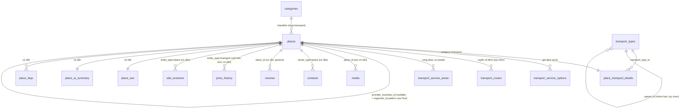

# PhuQuocHub — Thiết kế Database Module Transport (Vận chuyển)

> **✅ ĐÃ TRIỂN KHAI** (governance reconciliation, 2026-07-30) — [ADR-017](../../99-decisions/ADR-017-transport-domain-foundation.md) đã **Accepted và migrate**: migration `1720002300000-InitTransport.ts` áp dụng trên database sống (`migration:show` → `[X]`), module `apps/api/src/modules/transports/` đang chạy (`GET /transports`, `GET /transports/{slug}`), tài liệu hoá ở `docs/api/openapi.yaml`. §0 và §9 bên dưới vẫn là ghi chép **lịch sử** (trạng thái repo TRƯỚC khi module này được viết, và ghi chú roadmap tại thời điểm thiết kế) — không phải mô tả sai, chỉ là mốc thời gian khác; đọc theo ngữ cảnh từng mục. Nội dung §2–§5 (schema) khớp đúng migration đã chạy, chưa gấp vào [places.md §13](./places.md) — việc đó vẫn là tương lai.
>
> Luôn kiểm tra `\dt` trên database thật hoặc `apps/api/src/core/database/migrations/` để xác nhận trạng thái hiện tại thay vì chỉ tin tài liệu này.

---

## 0. Phạm vi audit đã thực hiện trước khi viết tài liệu này

Xác nhận trực tiếp trên repo + PostgreSQL sống trước khi thiết kế bất cứ điều gì (không suy đoán):

| Kiểm tra | Kết quả |
|---|---|
| Bảng khớp `%transport%`/`%vehicle%`/`%ferry%`/`%route%` | 0 |
| `categories.slug` hiện có | `attraction, beach, cafe, hotel, market, resort, restaurant, tour` — không có `transport` |
| Business ownership (`business_claims`/`business_members`) | Thiết kế Accepted (ADR-015) nhưng **0 bảng** trong DB sống — chưa migrate |
| Verification (`verifications`/`verification_events`/`verification_votes`) | Thiết kế Accepted (ADR-008) nhưng **0 bảng** trong DB sống — chưa migrate |
| `price_history.entity_type` | `VARCHAR(30)` tự do, không phải ENUM — mở rộng giá trị không cần DDL |
| `categories.parent_id` | Có sẵn, tự tham chiếu, **hiện chưa vertical nào dùng** (mọi category đang phẳng) |
| Endpoint lookup từ điển (`GET /amenities`, `/cuisines`, ward…) | **Không tồn tại** ở bất kỳ vertical nào — frontend hardcode các danh sách này |

---

## 1. Nguyên tắc thiết kế

Kế thừa nguyên vẹn 6 nguyên tắc của [places.md §1](./places.md), cộng thêm hai nguyên tắc riêng cho Transport:

7. **Trục phân loại phải mở rộng được không cần migration** (yêu cầu sản phẩm — không hardcode 12 loại hình như category bắt buộc). Vì vậy `transport_type` là **từ điển** (bảng, FK), không phải ENUM — khác mọi satellite trước đó.
8. **Trường chưa xác nhận được → NULL, không default che giấu.** Bài học trực tiếp từ lỗ hổng seed đã vá ở Hotel/Restaurant/Tour (star_rating/duration/cuisine bị bỏ trống thay vì suy đoán) và từ quyết định không suy diễn an toàn bơi lội cho Beach: mọi cột "có/không" liên quan tới cam kết dịch vụ thật (`booking_required`, `airport_transfer`) là **BOOLEAN NULLABLE tri-state**, không `NOT NULL DEFAULT false`.

## 2. Sơ đồ quan hệ (ERD)

**Đọc ERD này thế nào:** mọi cạnh ở khối "hạ tầng tái dùng" đã tồn tại trong schema hôm nay và áp dụng cho MỌI Place — Transport không cần bảng mới cho bất kỳ cạnh nào trong khối đó. Chỉ 5 bảng ở khối trên là mới, và tất cả đều tuân thủ ADR-003 (FK thật, không polymorphic).

## 3. Bảng mới (5 bảng, ĐÃ TRIỂN KHAI — `1720002300000-InitTransport.ts`)

### 3.1 `transport_types` — từ điển loại hình (thay ENUM)

| Cột | Kiểu | Null | Ghi chú |
|---|---|---|---|
| `id` | UUID (PK) | ✗ | |
| `code` | VARCHAR(60) | ✗ | **UNIQUE** — vd `taxi`, `airport_transfer`, `ferry`, `cano`, `speedboat`, `private_car`, `motorbike_rental`, `bicycle_rental`, `electric_buggy`, `bus`, `yacht_charter`, `shuttle` |
| `label_vi` / `label_en` | VARCHAR(120) | ✗ / ✓ | |
| `icon` | VARCHAR(120) | ✓ | cùng quy ước `amenities.icon`/`categories.icon` |
| `parent_id` | UUID (FK → transport_types) | ✓ | tái dùng nguyên mẫu `categories.parent_id` — cho phép nhóm hiển thị (vd "Đường thuỷ" cha của ferry/cano/speedboat/yacht_charter) mà không bắt buộc dùng ngay |
| `sort_order` | INT | ✗ | default 0 — thứ tự hiển thị trong bộ lọc |
| `is_active` | BOOLEAN | ✗ | default true — ẩn loại hình đã ngừng dùng mà không xoá (giữ toàn vẹn tham chiếu từ `place_transport_details` cũ) |
| `created_at` / `updated_at` | TIMESTAMPTZ | ✗ | |

**Unique:** `code`. **Index:** `parent_id`. **Cascade:** `parent_id` → `ON DELETE NO ACTION` (không cho xoá một loại còn con).

> Vì sao KHÔNG phải ENUM: mission yêu cầu tường minh "không hardcode như category bắt buộc"; ENUM đóng buộc migration mỗi khi thêm loại hình mới (vd tương lai "Helicopter Transfer"), trái đúng yêu cầu đó. Đây là satellite DUY NHẤT trong repo dùng mẫu này — xem lý do đầy đủ ở [ADR-017 §Decision-1](../../99-decisions/ADR-017-transport-domain-foundation.md).

### 3.2 `place_transport_details` — 1:1 với `places`

| Cột | Kiểu | Null | Ghi chú |
|---|---|---|---|
| `place_id` | UUID (PK, FK → places) | ✗ | 1:1; `ON DELETE CASCADE` |
| `transport_type_id` | UUID (FK → transport_types) | ✗ | mọi listing PHẢI khai đúng một loại hình chính; `ON DELETE NO ACTION` |
| `provider_business_id` | UUID (FK → places) | ✓ | nhà cung cấp = một Place đã claim, **tái dùng nguyên hệt** `place_tour_details.organizer_id` (đã tồn tại từ InitTour, cùng kiểu FK `ON DELETE NO ACTION`) — KHÔNG phát minh entity `TransportOperator` riêng |
| `pricing_model` | ENUM | ✓ | `fixed, starting_from, per_km, per_hour, per_person, per_vehicle, contact` — NULL = chưa xác định (khác `contact`, vốn là một khai báo tường minh "chỉ báo giá khi liên hệ") |
| `price_ref` | NUMERIC(12,2) | ✓ | cache hiển thị nhanh, cùng vai trò `hotel_room_types.price_ref`/`tour_schedules.price`; nguồn xác minh/lịch sử thật là `price_history` (ADR-006) |
| `price_currency` | CHAR(3) | ✗ | default `VND` |
| `price_unit` | VARCHAR(40) | ✓ | chỉ có ý nghĩa khi `pricing_model` thuộc `per_*` (vd "km", "giờ", "khách", "chuyến") |
| `capacity_passengers` | SMALLINT | ✓ | sức chứa tối đa khi loại hình có xe/thuyền cố định; NULL = không áp dụng hoặc chưa xác nhận (KHÔNG suy ra 0) |
| `booking_required` | BOOLEAN | ✓ | **tri-state có chủ đích** — NULL = chưa xác nhận, KHÔNG default `false` (xem nguyên tắc 8, §1) |
| `airport_transfer` | BOOLEAN | ✓ | cùng lý do tri-state |
| `booking_note` | VARCHAR(300) | ✓ | mô tả tự do (vd "Đặt trước tối thiểu 2 giờ") — KHÔNG dựng "BookingPolicy" thành entity có cấu trúc (không có product spec/dữ liệu nào cần cấu trúc hoá ở giai đoạn này; xem Phase 22 loại trừ checkout/payment) |
| `created_at` / `updated_at` | TIMESTAMPTZ | ✗ | |

**Index:** `transport_type_id`; `provider_business_id` WHERE NOT NULL.

### 3.3 `transport_service_options` — 1:N, gói dịch vụ/mức giá (tuỳ chọn)

Tái dùng nguyên khuôn `hotel_room_types` (đổi tên miền), cho các listing có nhiều mức (vd taxi 4 chỗ/7 chỗ, cano riêng theo giờ):

| Cột | Kiểu | Null | Ghi chú |
|---|---|---|---|
| `id` | UUID (PK) | ✗ | |
| `place_id` | UUID (FK → places) | ✗ | `ON DELETE CASCADE` |
| `name` | VARCHAR(120) | ✗ | vd "Xe 4 chỗ", "Cano riêng 6 khách" |
| `capacity_passengers` | SMALLINT | ✓ | |
| `price_ref` | NUMERIC(12,2) | ✓ | |
| `price_currency` | CHAR(3) | ✗ | default `VND` |
| `price_unit` | VARCHAR(40) | ✓ | |
| `valid_from` / `valid_to` | TIMESTAMPTZ | ✓ | giá theo mùa/khung giờ, cùng mẫu `hotel_room_types` |
| `sort_order` | INT | ✗ | default 0 |
| `created_at` / `updated_at` | TIMESTAMPTZ | ✗ | |

**Index:** `(place_id, sort_order)`.

### 3.4 `transport_routes` — 1:N, tuyến cố định (tuỳ chọn)

Cho ferry/cano/speedboat có điểm đi–đến rõ ràng; taxi/private car KHÔNG có dòng nào ở bảng này (đi khắp vùng phục vụ, không phải tuyến cố định). Cấu trúc gần giống `tour_stops`:

| Cột | Kiểu | Null | Ghi chú |
|---|---|---|---|
| `id` | UUID (PK) | ✗ | |
| `place_id` | UUID (FK → places) | ✗ | `ON DELETE CASCADE` |
| `origin_label` | VARCHAR(160) | ✗ | vd "Cảng An Thới" |
| `origin_location` | GEOGRAPHY(Point,4326) | ✓ | |
| `destination_label` | VARCHAR(160) | ✗ | vd "Hòn Thơm" |
| `destination_location` | GEOGRAPHY(Point,4326) | ✓ | |
| `note` | VARCHAR(300) | ✓ | vd tần suất mô tả bằng lời — KHÔNG lịch chạy có cấu trúc (live schedule bị loại trừ ở Phase 22/10) |
| `sort_order` | INT | ✗ | default 0 |
| `created_at` / `updated_at` | TIMESTAMPTZ | ✗ | |

**Index:** `(place_id, sort_order)`; `GIST(origin_location)` WHERE NOT NULL; `GIST(destination_location)` WHERE NOT NULL.

### 3.5 `transport_service_areas` — vùng phục vụ (N:N kiểu junction)

| Cột | Kiểu | Null | Ghi chú |
|---|---|---|---|
| `place_id` | UUID (FK → places) | ✗ | **PK phần 1**; `ON DELETE CASCADE` |
| `ward` | VARCHAR(120) | ✗ | **PK phần 2** — tái dùng NGUYÊN VĂN vùng giá trị tự do của `places.ward` (không phải FK tới từ điển mới) |

**PK:** `(place_id, ward)`. **Index:** `ward` (tra cứu ngược "những transport nào phục vụ ward X").

> Vì sao KHÔNG có bảng `service_areas` từ điển riêng: `ward` đã là quy ước text tự do xuyên suốt Tour/Attraction/Beach (không FK, không whitelist — giá trị lạ chỉ khớp 0 dòng). Tạo một từ điển chuẩn hoá CHỈ cho Transport sẽ là bất nhất cục bộ. Ghi nhận là cải tiến khả dĩ tương lai ở ADR-017 §Notes, không phải quyết định của bản thiết kế này.

## 4. Quan hệ & cardinality — vì sao mỗi quan hệ tồn tại

| Quan hệ | Cardinality | Lý do |
|---|---|---|
| `places ↓ place_transport_details` | 1:1 | Discriminator ADR-002 — mọi Transport listing là MỘT Place chuyên biệt, giữ nguyên toàn bộ tầng lõi (toạ độ, tên, slug, trạng thái). |
| `transport_types ↓ place_transport_details` | 1:N | Một loại hình có nhiều listing; một listing có ĐÚNG MỘT loại hình chính (không N:N — một taxi công ty không đồng thời là "ferry"). |
| `transport_types ↓ transport_types` (parent_id) | 1:N tự tham chiếu | Nhóm hiển thị tuỳ chọn (Đường bộ/Đường thuỷ), tái dùng mẫu `categories.parent_id`. |
| `places ↓ transport_service_options` | 1:N | Một listing có 0..N gói giá/xe khác nhau — giống `hotel_room_types`. |
| `places ↓ transport_routes` | 1:N | Một listing (ferry/cano) có 0..N tuyến cố định; taxi/private car luôn có 0 dòng. |
| `places ↓ transport_service_areas` | 1:N (qua junction) | Một listing phục vụ 0..N ward. |
| `places (provider) ↓ place_transport_details.provider_business_id` | 1:N, self-referencing qua `places`, nullable | Nhà cung cấp = một Place khác đã claim (business page); NULL cho tới khi có claim thật — tái dùng `organizer_id` của Tour, không tạo `Business`/`TransportOperator` entity riêng. |
| `places ↓ media/contacts/reviews/wiki_revisions/place_faqs/place_seo/place_ai_summary` | như mọi Place khác | Không có cạnh nào riêng cho Transport — 100% tái dùng, đây là điểm mạnh chính của việc chọn satellite thay vì domain độc lập. |
| `places ↓ price_history` (entity_type='transport') | 1:N, polymorphic (ADR-006) | Giá xác minh/lịch sử — không tạo bảng giá riêng cho Transport. |
| Future: `business_claims/business_members ↓ places` | (đã thiết kế, chưa migrate) | Khi ADR-015 được thi hành, một Transport listing "claim được" ngay lập tức — 0 việc cần làm thêm cho Transport. |

**Không có quan hệ N:N thật sự nào** ngoài `transport_service_areas` (junction 2 cột, không cần bảng id riêng — cùng mẫu `place_amenities`/`place_cuisines`/`role_permissions`).

## 5. Nullable — bảng quyết định tổng hợp

| Trường | Null? | Vì sao |
|---|---|---|
| `place_transport_details.transport_type_id` | ✗ | Phân loại chính — không có nghĩa nếu bỏ trống (giống `hotel_type`/`tour_type` NOT NULL). |
| `place_transport_details.provider_business_id` | ✓ | Business ownership chưa migrate; hầu hết listing ban đầu sẽ không có claim. |
| `place_transport_details.pricing_model` / `price_ref` / `price_unit` | ✓ | Chưa xác nhận ≠ miễn phí/liên hệ — tri-state có chủ đích. |
| `place_transport_details.capacity_passengers` | ✓ | Không áp dụng (thuê xe máy/xe đạp = theo đơn vị, không phải "chỗ ngồi") hoặc chưa xác nhận — hai lý do khác nhau, cùng biểu diễn NULL vì không có nguồn phân biệt được chúng ở tầng dữ liệu này. |
| `place_transport_details.booking_required` / `airport_transfer` | ✓ | Tri-state — xem nguyên tắc 8. |
| `transport_routes.origin_location` / `destination_location` | ✓ | Có thể mô tả tuyến bằng tên trước khi có toạ độ chính xác (label luôn NOT NULL, toạ độ là bổ sung). |
| Mọi `created_at`/`updated_at` | ✗ | Nhất quán toàn repo. |

## 6. Kế hoạch migration (chưa thực thi)

Theo đúng tiền lệ thật của repo — `InitHotel`/`InitRestaurant`/`InitTour` mỗi vertical gộp TOÀN BỘ bảng/enum/seed category của nó trong **một** file migration, reversible qua một `down()` — **không** phải "một migration mỗi bảng" như cách đọc chữ nghĩa của Phase 6 gợi ý. Ưu tiên bằng chứng repo hơn suy đoán, theo đúng chỉ đạo cuối mission.

**Một migration duy nhất, `InitTransport`:**
1. Tạo ENUM `pricing_model`.
2. Tạo `transport_types` (+ seed 12 mã — xem §7, đây là DỮ LIỆU THAM CHIẾU, không phải doanh nghiệp).
3. Tạo `place_transport_details` (FK → places, → transport_types).
4. Tạo `transport_service_options`, `transport_routes` (+ GIST index), `transport_service_areas`.
5. INSERT một dòng `categories` mới (`slug='transport'`) — cùng vị trí trong file mà `InitTour` seed dòng `categories` `'tour'` của nó.
6. `down()`: xoá theo thứ tự ngược, drop ENUM cuối cùng — cùng mẫu mọi `InitX.down()` hiện có.

**Không cần migration nào cho `price_history`** — `entity_type` đã là `VARCHAR(30)` tự do; `'transport'` chỉ là một giá trị ứng dụng ghi vào, không phải thay đổi schema.

## 7. Chiến lược seed — tách bạch dữ liệu tham chiếu và dữ liệu doanh nghiệp

**Dữ liệu tham chiếu (seed CÙNG `InitTransport`, an toàn vì không đại diện một doanh nghiệp thật nào):**

12 mã `transport_types` từ chính danh sách candidate của mission — đây là MỘT TỪ ĐIỂN (taxonomy), không phải một tuyên bố về công ty nào tồn tại:

`taxi, airport_transfer, shuttle, ferry, cano, speedboat, private_car, motorbike_rental, bicycle_rental, electric_buggy, bus, yacht_charter`

**Dữ liệu doanh nghiệp (KHÔNG seed cùng ADR/thiết kế này):**

Mission cho phép "demonstrational seed data where repository policy allows." Đã rà toàn bộ 23 migration hiện có — **không tìm thấy chính sách nào trong repo cho phép seed doanh nghiệp trình diễn/hư cấu.** Ngược lại: mọi địa điểm từng seed (Bãi Sao → JW Marriott Phú Quốc Emerald Bay) đều là **địa điểm/doanh nghiệp có thật tại Phú Quốc**, và phiên làm việc gần nhất của repo này vừa từ chối gán `star_rating`/`duration_minutes`/`cuisine` suy đoán cho các doanh nghiệp thật hiện có, đúng nguyên tắc "không bịa dữ liệu về cơ sở kinh doanh có thật."

**Kết luận:** repository policy hiện tại **không cho phép** seed demonstrational business data. Khuyến nghị: hoãn mọi dòng `place_transport_details`/`places(category=transport)` tới khi có nguồn dữ liệu thật kiểm chứng được (qua pipeline provenance ở [source.md](./source.md)), hoặc tới khi có quyết định sản phẩm tường minh khác đi (khác ADR này).

## 8. API — nền tảng và bộ lọc mở rộng ĐỀU đã triển khai; trang Browse công khai (frontend) thì CHƯA

**Cập nhật (Transport Browse Filters, 2026-08-01):** `GET /transports`, `GET /transports/{slug}`, `GET /transport-types` đã triển khai từ trước (`transports.controller.ts`/`transport-types.controller.ts`), cùng `sort` (khớp đúng §8.1 dưới đây, không lệch). **Bộ lọc mở rộng bên dưới (`transport_type`/`ward`/`pricing_model`/`booking_required`/`airport_transfer`) NAY CŨNG ĐÃ TRIỂN KHAI** — `ListTransportsQueryDto` (`apps/api/src/modules/transports/dto/transports.dto.ts`) nay có đủ 5 trường này cộng `sort`/`page`/`limit`, khớp chính xác bảng tham số bên dưới; không cần migration/schema mới (mọi cột/index hậu thuẫn đã có sẵn từ `InitTransport`). Xem
[docs/delivery/reports/TRANSPORT-BROWSE-FILTERS-2026-08-01.md](../../delivery/reports/TRANSPORT-BROWSE-FILTERS-2026-08-01.md).

> **Phân biệt rõ 3 trạng thái, không được nhầm lẫn:**
> 1. **Backend — ĐÃ triển khai:** cả 5 bộ lọc trong bảng bên dưới (`transport_type`/`ward`/`pricing_model`/`booking_required`/`airport_transfer`), cộng `sort`/`page`/`limit`.
> 2. **Backend — CÒN hoãn có chủ đích** (§ ngay dưới bảng): `capacity_min`/`capacity_max` (chưa có dữ liệu thật để lọc có ý nghĩa), `district` (không có cột), `provider` (Business ownership chưa migrate). Đều vẫn bị từ chối `400`, không silent-ignore.
> 3. **Frontend — trang Browse công khai `/transports` (Next.js): CHƯA triển khai.** Transport là vertical DUY NHẤT trong 6 vertical (Hotel/Restaurant/Tour/Attraction/Beach/Transport) chưa có trang duyệt danh sách nào ở `apps/web` — không có route `apps/web/src/app/(public)/transports/`. Xây trang này nằm NGOÀI phạm vi ADR-017's Accepted scope hiện tại ("schema + đọc tối thiểu, KHÔNG gồm trang Browse công khai") và ngoài phạm vi milestone Transport Browse Filters (backend-only, tường minh "Do not begin a frontend Transport browse page"). Không tài liệu nào ở đây được suy diễn thành "trang Browse đã có" — không có UI nào gọi các bộ lọc mới này cả.

Đường dẫn endpoint bên dưới đã sửa lại khớp thực tế (trước đây ghi số ít `/transport/...`, thực tế là số nhiều `/transports/...` + `/transport-types` phẳng — xem [ADR-017 Status](../../99-decisions/ADR-017-transport-domain-foundation.md)).

Theo đúng conventions đã dùng cho Attraction/Beach/Tour: `ValidationPipe({ whitelist: true, forbidNonWhitelisted: true })`, envelope `{success, data, meta}`, phân trang OFFSET (`page`/`limit`, default 20/max 100 qua `clampLimit`/`clampPage`), sort whitelist cố định phía server với khoá phụ `id ASC`.

### `GET /transports` — danh sách (Public)

| Tham số | Giá trị | Ánh xạ | Ghi chú |
|---|---|---|---|
| `transport_type` | mã trong `transport_types.code` | `place_transport_details.transport_type_id` (qua join code→id) | so khớp chính xác |
| `ward` | text tự do | `transport_service_areas.ward` (EXISTS) | cùng quy ước ward tự do như mọi vertical khác, NHƯNG DTO này không có `@MaxLength(120)` (khác Attraction/Beach/Tour) — chưa cần vì `EXISTS` trên bảng riêng, không phải so sánh trực tiếp cột `places.ward` |
| `pricing_model` | `fixed\|starting_from\|per_km\|per_hour\|per_person\|per_vehicle\|contact` | `place_transport_details.pricing_model` | |
| `booking_required` | `true\|false` | `place_transport_details.booking_required = $n` | **CHỈ khớp giá trị TƯỜNG MINH** — `booking_required=false` KHÔNG khớp NULL (tri-state), phải nêu rõ trong response docs để không ai đọc "0 kết quả" là lỗi |
| `airport_transfer` | `true\|false` | tương tự | cùng quy tắc tri-state |
| `sort` | `rating_desc` (default) `\|name_asc\|newest` | xem §8.1 | KHÔNG có `price_asc/desc` — xem lý do dưới |
| `page`/`limit` | số nguyên | | default 1/20, max 100 (clamp không từ chối) |

**Từ chối 400 (`forbidNonWhitelisted`), không âm thầm bỏ qua:** `category` (đã là chính endpoint này), `district` (không có cột), `capacity_min`/`capacity_max` (chưa có dữ liệu thật để lọc có ý nghĩa — hoãn tới khi `transport_service_options`/`capacity_passengers` có hàng thật), `provider` (Business ownership chưa migrate).

#### 8.1 Sort — vì sao KHÔNG có price_asc/desc

`pricing_model` không đồng nhất giữa các dòng (`per_km` vs `fixed` vs `contact`) — sắp theo `price_ref` số học sẽ so sánh hai đơn vị khác nhau (200.000₫/km cạnh 500.000₫/chuyến) như thể chúng cùng thang đo, đúng cái bẫy Phase 7 cảnh báo tường minh. Ba mode được đề xuất, mỗi mode có khoá phụ `id ASC`:

| `sort` | ORDER BY |
|---|---|
| `rating_desc` (default) | `rating_avg DESC NULLS LAST, created_at DESC, id ASC` |
| `name_asc` | `name ASC, id ASC` |
| `newest` | `created_at DESC, id ASC` |

`capacity_desc`/`most_reviewed` **hoãn** — chưa có dữ liệu thật (0 listing) để chứng minh mode có ý nghĩa; thêm sau khi có seed thật, cùng cách Tour/Attraction/Beach chỉ thêm sort mode có dữ liệu hậu thuẫn.

### `GET /transports/{slug}` — chi tiết (Public)

Endpoint RIÊNG (không dùng chung `/places/{slug}` như Attraction/Beach) — lý do đầy đủ ở [ADR-017 §Decision-9](../../99-decisions/ADR-017-transport-domain-foundation.md). Response = `Place` (đã có `category_slug='transport'` từ thay đổi session trước) + `transport_details` + `service_options[]` + `routes[]` + `service_areas[]`. Cùng mẫu ghép `PlacesService.getBySlug()` rồi bổ sung của Hotel/Tour.

### `GET /transport-types` — từ điển (Public, không phân trang, route phẳng top-level)

**Endpoint MỚI, đóng một khoảng trống đã tồn tại từ trước:** không vertical nào hiện có (`amenities`, `cuisines`, ward) có endpoint tra cứu — frontend hardcode. Transport là vertical ĐẦU TIÊN có từ điển thật sự truy vấn được: `{id, code, label_vi, label_en, icon, parent_id}[]`, sắp theo `sort_order`.

### KHÔNG đề xuất — hoãn có chủ đích

- **`GET /transport-operators`** (hoặc tương đương) — không có mô hình dữ liệu đứng sau ngoài `provider_business_id` (một Place khác); Business ownership chưa migrate. Xem [ADR-017 §Alternatives](../../99-decisions/ADR-017-transport-domain-foundation.md).
- **`GET /transport-service-areas`** (hoặc tương đương) — không có từ điển `service_areas` riêng (§3.5 dùng `ward` tự do) nên không có gì để liệt kê ngoài `GET /transports?ward=X` như một filter (đã triển khai, xem §8), đúng khoảng trống đã tồn tại (không tệ hơn) ở Tour/Attraction/Beach.

## 9. Lộ trình tương lai — vì sao nền tảng này không cần thiết kế lại

| Tính năng tương lai | Vì sao nền tảng hiện tại đủ chỗ |
|---|---|
| **Browse** | §8 `GET /transports` — đã triển khai (Public, đọc danh sách). |
| **Detail** | §8 `GET /transports/{slug}` — đã tính đến service_options/routes. |
| **Search** | `places.idx_places_fts` đã phủ mọi Place kể cả Transport; không cần index riêng. |
| **Booking/Payment** | Nằm ngoài phạm vi (Phase 22) — nhưng `transport_service_options` đã là đơn vị "mặt hàng có giá" hợp lý để một booking tương lai tham chiếu tới (`option_id`), không cần thiết kế lại bảng giá. |
| **Operator dashboard** | Khi ADR-015 thi hành, `provider_business_id`→`places` là đúng cầu nối; dashboard Business hiện có (docs/product/modules/business.md) áp dụng nguyên vẹn. |
| **Availability** | Không có trong thiết kế này (đúng loại trừ Phase 10/22) — nhưng `transport_routes`/`transport_service_options` là đơn vị hợp lý để một bảng lịch trình tương lai (kiểu `tour_schedules`) gắn `place_id`/`option_id`/`route_id` vào, không phá vỡ gì đã có. |
| **Reviews** | Đã hoạt động ngay lập tức — `reviews.place_id` generic. |
| **Maps** | `places.location` (mọi Transport listing là 1 Place có toạ độ) + `transport_routes` (điểm đi/đến) đã đủ dữ liệu không gian; không cần bảng geo riêng. |
| **Route planning** | Nằm ngoài phạm vi — nhưng `transport_routes.origin_location`/`destination_location` (GEOGRAPHY, đã GIST-index) là đúng nguyên liệu thô nếu tính năng đó được duyệt sau này. |

---

*Tài liệu liên quan: [ADR-017](../../99-decisions/ADR-017-transport-domain-foundation.md) (quyết định), [places.md](./places.md) (mẫu satellite gốc), [ADR-002](../../99-decisions/ADR-002-place-extension.md)/[ADR-003](../../99-decisions/ADR-003-no-polymorphic.md)/[ADR-006](../../99-decisions/ADR-006-price-history.md) (nguyên tắc kế thừa).*
