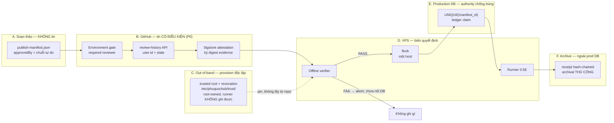
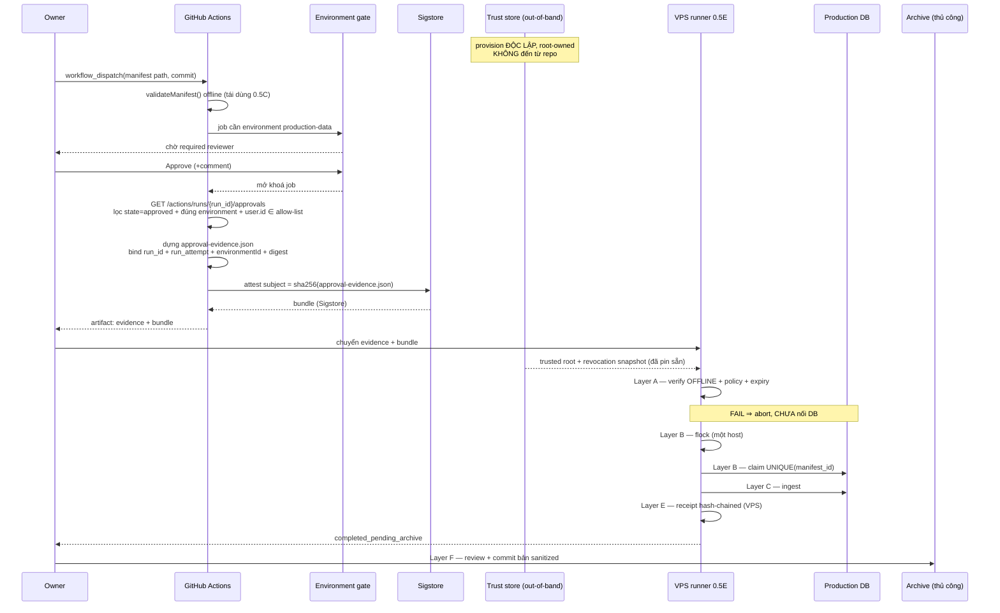

# Authenticated Approval & Audit Evidence — Design (Slice 0.5D)

**Loại:** read-only investigation + threat model + architecture design. Không triển khai code,
không migration, không sửa workflow/schema/compose/script, không git add/commit/push/PR/merge/
deploy, không truy cập production, không tạo GitHub Environment, không sửa branch protection.
**Ngày:** 2026-08-25 · **Model:** Opus 5
**Git state khi viết:** branch `feat/place-administrative-backfill`, HEAD
`a2c490938fd92070370dd9c1d9354f9704529ee0`, ahead 0 / behind 0, không tracked changes.
**Thay đổi duy nhất của nhiệm vụ này:** chính file báo cáo này (untracked).

> ## ⚠️ AMENDMENT 1 — 2026-08-25 (design-only, sau owner review)
>
> Owner đã review bản đầu, **chưa phê duyệt implementation 0.5D1**, và cung cấp bằng chứng mới +
> chốt 5 owner decisions. Bản này đã được sửa tại chỗ. **Chín correction**, trong đó bốn cái sửa
> **lỗi thiết kế thật**, không phải làm rõ câu chữ:
>
> | # | Sửa gì | Loại |
> |---|---|---|
> | C1 | Cách lấy approver identity: **phải** gọi review-history API cho chính `run_id`, bind cả `run_attempt`; **cấm** dùng `github.actor`/`actor_id`/input/`payload.approval.approvedBy` | **Lỗi thiết kế** |
> | C2 | Trusted root **KHÔNG** nằm trong repo được verify — chuyển sang out-of-band, root-owned path trên VPS | **Lỗi bảo mật** (circular trust) |
> | C3 | Git ledger **KHÔNG** phải replay authority — tách 4 lớp A/B/C/D, authority là `UNIQUE(manifest_id)` trong DB | **Lỗi thiết kế** |
> | C4 | Receipt archival: runner **không** giữ PAT dài hạn để push git; flow thủ công + trạng thái `completed_pending_archive` | **Lỗi vận hành** |
> | C5 | §9 sequence tự mâu thuẫn ("bước 1–9 offline" nhưng "bước 6 mở DB") — đánh số lại theo boundary A–F | Mâu thuẫn |
> | C6 | 5 owner decisions **đã chốt** (đáng chú ý: validity window **24 giờ**, không phải 7 ngày) | Cập nhật |
> | C7 | Repo **đã xác minh public** (id `1297370007`, owner id `302432067`) — gỡ khỏi Known unknowns | Cập nhật |
> | C8 | Tách preconditions: 0.5D1 làm được **trước** P0; 0.5D3 **tuyệt đối không** | Làm rõ |
> | C9 | Bổ sung đầy đủ field cho contract 0.5D1 + ranh giới D1 không làm gì | Cập nhật |
>
> Mọi câu trong bản đầu mâu thuẫn với các correction này **đã bị xoá hoặc viết lại**, không để lại
> hai phiên bản song song.

> ## ⚠️ AMENDMENT 2 — 2026-08-25 (design-only, owner vẫn CHƯA phê duyệt 0.5D1)
>
> Sáu correction nữa, trong đó **ba cái sửa lỗi thật của Amendment 1**:
>
> | # | Sửa gì | Loại |
> |---|---|---|
> | **A** | `attestedArtifactDigest` **đã bị gỡ khỏi evidence payload** — Amendment 1 đặt digest của evidence *vào trong chính evidence*, tức self-reference không thể tính được | **Lỗi thiết kế (A1 gây ra)** |
> | **B** | `approvedAt` **đã bị gỡ** — GitHub review-history API **không hề trả timestamp của thao tác Approve**; Amendment 1 coi nó là authenticated fact là **sai sự thật** | **Lỗi sự thật (A1 gây ra)** |
> | **C** | Tách `reviewRecordDigest` (normalized, policy dùng) khỏi `rawReviewResponseDigest` (audit-only) | **Lỗi thiết kế (A1 gây ra)** |
> | **D** | Numeric GitHub ID chuyển sang **canonical decimal string** — tránh giới hạn an toàn của JS number | Phòng xa |
> | **E** | Viết chính xác nghĩa của "self-review tắt" | Làm rõ |
> | **F** | Phân loại trường D1 theo 6 nhóm A–F; chốt ranh giới D1 | Cập nhật |
>
> **Xác minh độc lập cho Correction B** (không chỉ tin mô tả): schema `environment-approvals` có
> **đúng 4 thuộc tính top-level** — `environments`, `state`, `user`, `comment`. **Không có**
> `submitted_at`/`reviewed_at`/`created_at` ở cấp approval. Hai trường `created_at`/`updated_at`
> **thuộc object `environment`**, mô tả *tài nguyên environment*, **không phải** thời điểm review.

---

## 1. Executive conclusion

Hôm nay, bất kỳ ai viết được một file JSON đều có thể tạo ra một manifest mà
`validateManifest()` chấp nhận với `approval.approvedBy: "nhuhao2023@gmail.com"`. Checksum **không
hề ngăn điều đó** — người giả mạo chỉ cần chạy `computeManifestChecksum()` trên payload họ vừa
bịa và ghi kết quả vào trường `checksum`. Đây không phải lỗ hổng bị bỏ sót: chính
`publish-manifest.contract.ts:34` đã ghi rõ điều này. Slice 0.5B/0.5C cố ý dừng ở **content
integrity** và để **authenticity** cho 0.5D.

**Kiến trúc đã chốt (OD-1): GitHub Environment required review (danh tính đã xác thực) + GitHub
artifact attestation qua Sigstore (ràng buộc mật mã lên digest) + verify OFFLINE trên VPS với
trusted root lấy out-of-band + replay guard phân lớp mà authority là `UNIQUE(manifest_id)` trong
DB + receipt archival thủ công ra ngoài production DB.**

Ba lý do quyết định:

1. **Không có private key dài hạn nào phải cất giữ.** Sigstore keyless dùng khóa phù du; không có
   file khóa nào nằm trên laptop owner, trong repo, hay trên VPS để bị đánh cắp.
2. **Verify được offline.** `gh attestation verify --bundle --custom-trusted-root` chạy trong môi
   trường air-gapped — nên runner 0.5E trên VPS xác minh xong **trước khi mở bất kỳ kết nối DB
   nào**, đúng yêu cầu #8.
3. **Environments khả dụng miễn phí cho public repository.** GitHub Docs: *"Users with GitHub Free
   plans can only configure environments for public repositories"*. Repo **đã xác minh public**
   (`visibility=public`, repository id `1297370007`, owner `haonhu2023` id `302432067`) — dùng
   được ngay, không cần nâng plan.

**Bốn giới hạn phải nói thẳng, không được giấu:**

- **0.5D đóng được impersonation, KHÔNG đóng được owner insider misuse.** OD-2 chốt MVP canary
  dùng **một owner với *Prevent self-review* TẮT** — nghĩa là cùng một con người soạn manifest,
  duyệt và publish. Điều 0.5D thực sự chứng minh là *"một danh tính GitHub đã xác thực, có quyền
  reviewer, đã bấm Approve trên đúng run này, và evidence được ký ràng buộc đúng digest này"* —
  **không** phải *"hai người độc lập đã kiểm tra"*. Hệ quả trực tiếp: **một GitHub account bị
  chiếm là phá cả approval lẫn trigger cùng lúc**, không còn lớp nào chặn. Vì vậy 2FA/passkey trên
  tài khoản owner là **bắt buộc**, và trước bulk publish hoặc dashboard doanh nghiệp thì **buộc
  phải chuyển sang hai người + bật Prevent self-review**.
- **Trust chain của GitHub chỉ mạnh bằng khả năng bảo vệ chính workflow file.** Bằng chứng API
  cũng xác nhận default branch **vẫn là `feat/place-administrative-backfill`**, chưa có `main`.
  Actions đang pin bằng **tag** (`@v4`, `@v3`) chứ không phải commit SHA. Nếu sửa được workflow
  thì attestation vẫn "hợp lệ" trong khi cổng duyệt đã bị gỡ — **API response của GitHub tự nó
  không phải chữ ký**; toàn bộ tính xác thực đến từ việc một workflow *đã được bảo vệ và pin* đọc
  API rồi cho attestation ký đúng digest evidence. **P0 là precondition cứng của 0.5D3**, không
  phải tuỳ chọn.
- **Verify offline không kiểm tra revocation.** GitHub Docs nói rõ: *"you will not know if key
  material has been revoked since you last generated the trusted root file"*. Bù bằng validity
  window **24 giờ** (OD-3) + revocation snapshot được provision **out-of-band cùng trusted root**,
  không phải đọc từ chính repo đang được verify.
- **Git không phải cơ chế chống replay.** Git commit không cung cấp lock nguyên tử cho runner.
  Authority chống trùng lô là **`UNIQUE(manifest_id)` trong production DB**; git/archive chỉ là
  **audit archive + nguồn đối soát**. Xem §11.

---

## 2. Current-state evidence

Mọi dòng dưới đây đọc trực tiếp từ HEAD `a2c4909`. Comment **không** được tính là bằng chứng khi
code nói khác.

| # | File:line | Hành vi hiện tại | Dùng được cho approval evidence? | Hạn chế / rủi ro |
|---|---|---|---|---|
| E1 | `publish-manifest.contract.ts:59` | `approvedBy: string` — chuỗi tự do trong payload | ❌ **Không** | Người tạo manifest tự gõ; không đối chiếu gì |
| E2 | `publish-manifest.contract.ts:34` | Comment tự thừa nhận: *"bất kỳ ai có thể gõ bất kỳ chuỗi nào vào trường đó rồi tự tính checksum khớp"* | — | Đây là **fact đã được xác nhận**, không phải nghi ngờ |
| E3 | `publish-manifest.contract.ts:205` `validateManifest()` | Thuần: không DB, không network, không RBAC | ⚠️ Một nửa | Xác minh cấu trúc + integrity; **không** identity (đúng thiết kế) |
| E4 | `validate-publish-manifest.ts` (0.5C) | CLI offline, đúng 2 import (`fs`, contract) | ✅ Khuôn mẫu tốt | Chứng minh mô hình "verifier offline thuần" khả thi |
| E5 | `audit.repository.ts:24` | Comment *"APPEND-ONLY … cấm UPDATE/DELETE"* | ⚠️ Cẩn trọng | **Chỉ là convention** — xem E6 |
| E6 | `1720001500000-InitAuditLogs.ts` toàn file | `CREATE TABLE` + 4 index. **Không** trigger, **không** RULE, **không** REVOKE, **không** RLS | ❌ **Không đủ** | App kết nối bằng `DB_USER=phuquoc` — user tạo bảng, tức **owner**, có đủ UPDATE/DELETE |
| E7 | `ADR-016:23` | Tuyên bố enforcement gồm *"quyền ghi DB chỉ `INSERT`"* | ❌ | **Nửa sau CHƯA được triển khai** — xem §19 Corrections |
| E8 | `auth.service.ts:248-258` `emitAudit()` | `try/catch`, nuốt lỗi, chỉ log | ❌ | **Fail-open tường minh** cho toàn bộ AuthService |
| E9 | `verifications/users/business/bookings` services | `await this.audit.record(...)` **sau khi transaction commit**, không try/catch | ❌ | Lỗi audit ném ra **sau khi mutation đã commit** ⇒ thay đổi vẫn tồn tại mà không có audit. Fail-open về mặt độ bền bằng chứng |
| E10 | `places.service.ts:315` | `status: RevisionStatus.APPROVED` ghi **trực tiếp** | ❌ | Không có moderation gate; comment thừa nhận *"Sprint 4 sẽ chuyển sang luồng pending"* |
| E11 | `business-claims.controller.ts:58` | `decide` yêu cầu permission `Business.Verify` | ⚠️ Tham khảo | Chứng minh *claim* được duyệt — **không** chứng minh quyền publish dữ liệu production |
| E12 | `verified-facts-ingestion.service.ts:197` `processOne()` | **Không** bọc transaction tổng; chỉ một phần dùng `dataSource.transaction` | ❌ | Ingestion thất bại giữa chừng ⇒ trạng thái một phần (threat T17) |
| E13 | migrations toàn bộ | Không migration nào nhắc `publish_manifest` / `manifest_id` / receipt | ❌ | **Manifest-level replay ledger chưa tồn tại** (item K) |
| E14 | `.github/workflows/ci.yml` | Không `permissions:`, không `id-token`, không `attestations`, không `environment:` | ❌ | Chưa có primitive trust nào của GitHub được bật |
| E15 | `ci.yml:15,17,41,43,102,116,225,227,291` | `actions/checkout@v4`, `actions/setup-node@v4`, `docker/login-action@v3` | ❌ | Pin bằng **tag**, không phải commit SHA — trái khuyến nghị chính thức của GitHub |
| E16 | `git ls-remote --heads origin` | Remote có **đúng một** branch: `feat/place-administrative-backfill`, và nó là **default branch** | ❌ | Không có `main`/`develop`; deployment branch policy chưa có gì để trỏ tới (item H) |
| E17 | `docker-compose.prod.yml:203-219` | Service `migrate` với `profiles: [tools]`, chạy bằng `docker compose run --profile tools` | ✅ **Khuôn mẫu chuẩn** | Đây chính là chỗ runner 0.5E nên nằm |
| E18 | `scripts/deploy.sh:6-8` | *"Intended to run **ON THE PRODUCTION VPS**"*; CI **không** deploy | ✅ Xác định topology | Item I: verifier phải chạy được trên VPS, không phải trong Actions |
| E19 | `PRODUCTION-DATA-DELIVERY-PATH-DESIGN-2026-08-24.md §7` | 16 threat về deploy/data | ⚠️ Thiếu | **Không threat nào** nói về giả mạo danh tính approver — đúng khoảng trống 0.5D lấp |
| E20 | `.env.example` | 34 biến; **không** biến nào liên quan signing/attestation | — | Sẽ cần thêm biến mới (tên đề xuất ở §7) |

**Kết luận Phase 1 theo từng mục kiểm tra bắt buộc:**

- **A.** ✅ Đúng — `approvedBy` chỉ là chuỗi nằm trong checksum (E1, E2).
- **B.** ✅ Đúng — `validateManifest()` không xác thực identity/RBAC (E3).
- **C.** Fail-open ở **mọi** đường: tường minh ở AuthService (E8), ngầm ở các service khác vì audit
  ghi sau commit (E9).
- **D.** **Chỉ là convention** — không có enforcement ở DB (E6, E7).
- **E.** Còn direct APPROVED path, chưa có moderation gate đầy đủ (E10).
- **F.** Business claim chứng minh *"người này được xác nhận sở hữu cơ sở"*; **không** chứng minh
  *"người này được phép ghi dữ liệu production"* (E11).
- **G.** Chưa có branch protection / signed commits / Environment / attestation (E14, E16).
- **H.** Default branch là feature branch ⇒ mọi chính sách trust dựa trên "ref" hiện **không có
  neo ổn định** (E16).
- **I.** Runner 0.5E chạy trên **VPS qua Docker Compose**, không phải GitHub Actions (E17, E18).
- **J.** Bằng chứng nằm trong Actions run/artifact sẽ mất khi hết retention ⇒ **không được** coi
  run log là sổ cái (xem §12).
- **K.** Idempotency ở cấp target đã có; **manifest-level replay ledger chưa có** (E13).

---

## 3. Trust boundaries

Hai điều kiện để tin biên B: (1) workflow file được bảo vệ và action pin bằng SHA — nếu không,
biên B tự sụp vì kẻ sửa được workflow tạo ra attestation "hợp lệ" mà cổng duyệt đã bị gỡ; (2)
**biên C phải độc lập với repo** — trusted root **không** được lấy từ chính checkout đang cần xác
minh, nếu không thì kẻ kiểm soát repo cũng kiểm soát luôn gốc tin cậy (circular trust).

**Lưu ý ranh giới:** biên E (DB) là nơi *chống trùng lô*, biên F (archive) là nơi *lưu bằng chứng*.
Hai vai trò này **không thay thế cho nhau** — xem §11.

---

## 4. Threat model

Slice chịu trách nhiệm: **D** = 0.5D, **E** = 0.5E, **F** = 0.5F, **P0** = hardening phải làm trước.

| # | Threat | Precondition | Impact | Detection | Prevention | Residual | Slice |
|---|---|---|---|---|---|---|---|
| T1 | Contributor tự ghi tên owner vào `approvedBy` | Ghi được file JSON | Dữ liệu sai lên production dưới danh nghĩa owner | Verifier báo thiếu attestation | Attestation bắt buộc; `approvedBy` **không** còn là căn cứ | Rất thấp | **D** |
| T2 | Laptop owner bị chiếm | Malware/mất máy | Kẻ tấn công thao tác như owner | GitHub security log; receipt bất thường | 2FA/passkey **bắt buộc** (OD-2); Sigstore keyless (không có file khóa để trộm) | **Trung bình** — không đóng được hoàn toàn | D + owner |
| T3 | GitHub session/token bị chiếm | Token rò rỉ | Approve giả **và** trigger giả cùng lúc (OD-2: một người) | Audit log GitHub | Token scope tối thiểu; 2FA/passkey; validity window **24h** | **CAO khi còn một người** — xem OD-2 | D + P0 |
| T4 | Commit độc hại sửa workflow/validator | Write access, không branch protection | **Toàn bộ trust chain sụp** | Diff review; workflow_ref pin | CODEOWNERS `.github/workflows`, branch protection, pin action bằng SHA | Thấp *sau* P0; **Cao nếu bỏ qua P0** | **P0** |
| T5 | Approval của manifest A gắn sang manifest B | Có evidence hợp lệ của A | Publish sai lô | Verifier so `manifestChecksum` trong evidence với file thật | Evidence bind digest; attestation subject = digest | Rất thấp | **D** |
| T6 | Manifest bị sửa sau khi duyệt | Sửa file sau approve | Nội dung khác nội dung đã duyệt | Checksum mismatch | Digest ký; verify lại tại VPS | Rất thấp | **D** |
| T7 | Replay manifest cũ đã publish | Có evidence cũ hợp lệ | Ghi đè/lặp lô cũ | DB ledger đã có `manifest_id` | **`UNIQUE(manifest_id)` — Layer B** + `notAfter` 24h — Layer A | Thấp | D+**E** |
| T8 | Cùng `manifestId`, checksum khác | Sửa nội dung, giữ id | Nhầm lẫn danh tính lô | DB ledger phát hiện xung đột id↔checksum | `UNIQUE(manifest_id)` + so `manifest_checksum`; khác ⇒ **abort** | Rất thấp | D+**E** |
| T9 | Cùng checksum, sai environment | Dùng evidence staging cho prod | Ghi nhầm môi trường | `targetEnvironment` trong evidence + `assertExpectedTarget` | Bind environment vào evidence **và** subject | Rất thấp | D+**E** |
| T10 | Approver đã bị thu hồi quyền | Thu hồi sau khi ký | Approval "chết" vẫn dùng được | So `approverSubjectId` với revocation snapshot | Validity window **24h** + revocation snapshot **out-of-band** (KHÔNG lấy từ repo đang verify) | **Trung bình** (offline không thấy revocation tức thì) | **D** |
| T11 | Run/artifact hết retention | Quá hạn lưu | Mất bằng chứng gốc | Thiếu bundle khi audit lại | Bundle + evidence archive **thủ công bởi owner** vào protected Git (C4), không dựa vào Actions retention | **Trung bình** — phụ thuộc owner thực sự archive | **D** |
| T12 | VPS operator thay artifact trước khi chạy | Truy cập VPS | Publish nội dung khác | Verify lại **trên VPS** ngay trước khi chạy | Verify là bước đầu tiên của runner, trước mọi kết nối | Thấp | **E** |
| T13 | DB admin sửa/xoá audit record | Quyền DB | Mất/giả dấu vết | Đối chiếu receipt trong git ↔ DB | **Không dùng DB làm nguồn duy nhất**; receipt ở git | Thấp | **D** |
| T14 | CI runner / third-party action bị compromise | Action bị chiếm | Evidence giả | Pin SHA; so `workflow_ref` | Pin commit SHA, `permissions` tối thiểu | Trung bình | **P0** |
| T15 | Emergency/bypass flag được thêm sau | Ai đó thêm cờ | Cổng duyệt vô hiệu | Code review; test âm | **Thiết kế không có cờ bypass**; test khẳng định không tồn tại | Thấp | **D** |
| T16 | Race giữa approval / verify / publish | Chạy song song | Ghi chồng | `flock` thất bại; UNIQUE violation | `flock` (Layer B, **chỉ một host**) + `UNIQUE(manifest_id)` (**authority, mọi host**) | Thấp | **E** |
| T17 | Ingestion thành công một phần rồi runner chết | `processOne` không transaction tổng (E12) | Trạng thái nửa vời | Receipt ghi per-target outcome | Idempotent retry; receipt `partial` | **Trung bình** | E + **F** |
| T18 | Restore DB làm mất ledger | Restore từ backup cũ | Replay lại lô đã chạy | Receipt VPS + archive vẫn còn | **Reconciliation bắt buộc (Layer D)** trước publish kế tiếp; lệch ⇒ abort + manual review | **Trung bình** — phụ thuộc kỷ luật đối soát | D+**F** |
| T19 | Timestamp máy không đáng tin | Máy sai giờ / producer tự khai | Validity window sai, approval "sống" quá hạn | `issuedAt` lệch > ±5 phút so với verified attestation time | **Hard cap 24h tính từ verified attestation time trong bundle** (cert validity / SET / TSA), **không** từ `reviewObservedAt`/`issuedAt` tự khai | **Trung bình** — Rekor `integratedTime` dùng đồng hồ nội bộ của Rekor (§18 mục 8) | **D** |
| T20 | Một người vừa tạo, vừa duyệt, vừa publish | Chỉ có một owner | Không có separation of duties | Receipt cho thấy cùng một subject id | **Không đóng được bằng kỹ thuật** — cần người thứ hai | **CAO — chấp nhận có ý thức** | Owner decision |

**T20 là rủi ro tồn dư lớn nhất và 0.5D không giải quyết được.** Phải ghi rõ điều này thay vì để
attestation tạo cảm giác an toàn sai.

---

## 5. Alternatives matrix

Thang: ✅ tốt · ⚠️ một phần · ❌ không đạt

| Tiêu chí | A. Chỉ `approvedBy`+checksum | B. Approval trong prod DB/RBAC | C. Git commit/PR/signed commit | D. Environment approval | E. Environment + attestation | F. Offline key (minisign/cosign/GPG) |
|---|---|---|---|---|---|---|
| Authentic identity | ❌ | ⚠️ (DB user) | ⚠️ (GPG nếu ký) | ✅ | ✅ | ✅ |
| Bind manifest digest | ⚠️ integrity | ❌ | ⚠️ | ⚠️ | ✅ | ✅ |
| Least privilege | ❌ | ⚠️ | ⚠️ | ✅ | ✅ | ⚠️ |
| Replay protection | ❌ | ⚠️ | ❌ | ❌ | ⚠️ **cần DB `UNIQUE`, không phải git** | ⚠️ (cần DB ledger) |
| Revocation | ❌ | ✅ | ⚠️ | ✅ (gỡ reviewer) | ✅ online / ⚠️ offline (snapshot out-of-band) | ❌ (khó) |
| Audit durability | ❌ | ❌ (DB restore/admin) | ✅ (git) | ⚠️ (retention) | ✅ (archive + bundle) | ✅ |
| Offline verification | ✅ | ❌ | ⚠️ | ❌ | ✅ | ✅ |
| Secret/key burden | ✅ không có | ⚠️ | ⚠️ | ✅ không có | ✅ **không có khóa dài hạn** | ❌ **nặng nhất** |
| VPS operability | ✅ | ✅ | ⚠️ | ❌ | ⚠️ (cần `gh`/cosign) | ⚠️ (cần tool) |
| GitHub dependency | ✅ không | ✅ không | ⚠️ | ❌ phụ thuộc | ❌ phụ thuộc | ✅ không |
| Chi phí vận hành | ✅ | ⚠️ | ⚠️ | ✅ | ⚠️ | ⚠️ |
| Hợp một owner | ✅ | ⚠️ | ✅ | ✅ | ✅ | ✅ |
| Nâng lên dual control | ❌ | ⚠️ | ⚠️ | ✅ **dễ nhất** | ✅ | ❌ (thêm khóa) |
| Độ phức tạp | ✅ thấp | ⚠️ | ✅ | ⚠️ | ❌ **cao nhất** | ⚠️ |
| Fail-closed | ❌ | ❌ | ❌ | ⚠️ | ✅ | ✅ |

**Vì sao loại từng phương án:**

- **A** — không đạt bất kỳ mục tiêu nào của 0.5D. Chính là hiện trạng cần sửa.
- **B** — **loại thẳng**: prod DB chính là thứ có thể bị restore hoặc bị admin sửa (E6, T13, T18).
  Dùng nó làm nguồn bằng chứng approval là để đối tượng bị bảo vệ tự chứng nhận cho mình. Ngoài ra
  runner phải **nối DB mới đọc được approval** — vi phạm yêu cầu #8 (verify trước khi nối DB).
- **C** — PR review chứng minh *code* được duyệt, không chứng minh *một digest manifest cụ thể*
  được duyệt. Signed commit (GPG) lại kéo về đúng gánh nặng khóa của F. Hiện repo còn **chưa có
  branch để mở PR vào** (E16).
- **D một mình** — cổng duyệt có thật nhưng **không để lại artifact ràng buộc digest**; VPS không
  có gì để verify offline ngoài việc gọi API GitHub (vi phạm khả năng offline, và tạo phụ thuộc
  GitHub lúc publish).
- **F** — kỹ thuật rất tốt và **không phụ thuộc GitHub**, nhưng: một owner giữ private key ⇒ mất
  key là mất khả năng publish, lộ key là mất tất cả; không có hạ tầng revocation; và vì cùng một
  người giữ cả manifest lẫn khóa, nó **không** tạo separation nhiều hơn E. Giữ F làm **phương án
  dự phòng** cho tình huống GitHub outage kéo dài (§11).

**Chọn E** vì nó là phương án duy nhất đạt đồng thời: bind digest ✅, offline verify ✅, không khóa
dài hạn ✅, fail-closed ✅, và nâng lên dual control dễ nhất ✅. Cái giá phải trả — độ phức tạp cao
nhất và phụ thuộc GitHub — được xử lý bằng phân rã sub-slice (§14) và fallback F (§11).

---

## 6. Recommended architecture

Ba artifact **tách rời**, không cái nào tự tham chiếu chính nó:

1. **`publish-manifest.json`** — đã có (0.5B). Không đổi. `approval.approvedBy` **giữ nguyên**
   nhưng bị hạ cấp thành *provenance mô tả*, và §7 quy định verifier **không** được dùng nó làm
   căn cứ cấp quyền.
2. **`approval-evidence.json` + attestation bundle** — mới (0.5D). Chứa digest của manifest, không
   chứa manifest.
3. **`publication-receipt.json`** — mới (0.5D contract, 0.5E sinh ra). Chứa digest của evidence,
   không chứa evidence.

**Tránh self-reference (Correction A):** mỗi lớp trỏ **xuống** lớp dưới bằng digest; **không lớp
nào chứa digest hay chữ ký của chính nó**.

Amendment 1 vi phạm chính nguyên tắc nó tuyên bố: nó đặt `attestedArtifactDigest` — digest của
`approval-evidence.json` — **vào trong `approval-evidence.json`**. Điều đó **không tính được**:
thêm digest vào file làm đổi bytes của file, làm đổi digest. **Đã gỡ khỏi payload.**

### Bốn artifact tách rời — ranh giới chính xác

| # | Artifact | Chứa gì | **Không** chứa gì |
|---|---|---|---|
| 1 | `publish-manifest.json` | Nội dung lô + `checksum` của payload (0.5B) | — |
| 2 | `approval-evidence.json` | Approval facts + binding (gồm `manifestChecksum`) | **Digest của chính nó**; **chữ ký/bundle của chính nó** |
| 3 | **Detached attestation bundle** (file riêng) | Subject digest = digest của **exact bytes** artifact 2; chứng cứ Sigstore | Nằm **ngoài** artifact 2 |
| 4 | `publication-receipt.json` | `approvalEvidenceDigest` + `attestationBundleDigest` | Nội dung evidence; digest của chính receipt nằm ngoài phần được hash |

Nếu cần một type mô tả tham chiếu attestation, nó phải là **artifact/type TÁCH BIỆT** (ví dụ
`ApprovalAttestationRefV1` đi kèm receipt hoặc đi kèm bundle), **tuyệt đối không** nằm trong subject
đang được hash.

### Exact-byte digest vs canonical-object digest — quy tắc chốt

GitHub/Sigstore attestation ký **digest của bytes file**, không phải digest của một object trừu
tượng. Hai thứ đó chỉ trùng nhau nếu producer kỷ luật. Sai lầm dễ mắc: tính digest trên
`canonicalJson(obj)` rồi lại **lưu/attest một file pretty-printed** có bytes khác — hai digest khác
nhau, nhưng bị gọi là một.

**Quy tắc chốt cho `approval-evidence.json`:**

1. Serialize bằng **đúng một** hàm deterministic — tái dùng `canonicalJson()` (`common/canonical-json.ts`,
   đã dùng cho manifest checksum 0.5B), khoá sắp xếp, **không** pretty-print, **không** khoảng trắng thừa.
2. Encode **UTF-8**, **không BOM**.
3. **Không newline cuối file** — `canonicalJson()` trả về đúng output của `JSON.stringify`, không
   thêm `\n`. Ghi file phải ghi đúng chuỗi đó, không để editor/tooling thêm newline.
4. **Bytes được ghi ra đĩa == bytes được hash == bytes được attest == bytes verifier đọc lại.**
   Không có bước "làm đẹp" nào ở giữa.
5. Digest = SHA-256 trên đúng bytes đó; đây là subject digest của bundle.

Verifier phải **hash lại exact bytes của file trên đĩa** và so với subject digest trong bundle —
**không** parse rồi re-serialize rồi hash (làm vậy sẽ che mất chính lớp sai lệch cần phát hiện).

### Luồng đầy đủ

### Cách lấy approver identity — bắt buộc (C1)

**Nguồn hợp lệ duy nhất:** `GET /repos/{owner}/{repo}/actions/runs/{run_id}/approvals`
(review-history API), gọi cho **chính `github.run_id` của run đang chạy**, sau khi environment gate
đã mở khoá job.

**Tuyệt đối KHÔNG dùng làm bằng chứng "ai đã bấm Approve":**

| Nguồn sai | Vì sao sai |
|---|---|
| `github.actor` / `github.actor_id` | GitHub Docs định nghĩa đây là *"the personal account that **initiated** the workflow run"* — người **trigger**, không phải người **duyệt**. Với OD-2 (một người) hai giá trị này trùng nhau **một cách tình cờ**; xây thiết kế lên sự trùng hợp đó sẽ **âm thầm sai** ngay khi có người thứ hai (OD-2 giai đoạn 2). |
| workflow input `approvedBy` | Do người trigger tự gõ — đúng lỗ hổng 0.5D sinh ra để đóng. |
| `payload.approval.approvedBy` | Chuỗi tự do trong manifest (E1/E2). |

**Thuật toán bắt buộc trong evidence-producing job:**

1. Gọi review-history API cho `github.run_id`.
2. Lọc lấy review thoả **đồng thời**: `state == "approved"`, environment khớp `environmentId`/
   `environmentName` đã pin trong policy, và `user.id` ∈ allow-list.
3. **Không có review hợp lệ ⇒ fail closed.**
4. **Nhiều approval mâu thuẫn hoặc không phân giải được duy nhất ⇒ fail closed.** Không "lấy cái
   mới nhất" — mơ hồ thì dừng.
5. Ghi `user.id` (numeric, ổn định) làm `approverSubjectId` — **căn cứ cấp quyền duy nhất**.
6. Ghi `user.login` vào `approverLogin` — **chỉ để hiển thị**, verifier cấm dùng để cấp quyền.
7. Lưu bản normalized của review record **và** `rawReviewResponseDigest` (sha256 của raw JSON
   response) vào evidence, để sau này đối soát lại được.
8. Bind vào evidence: `runId`, **`runAttempt`**, `environmentId`, `environmentName`, `reviewState`,
   `approverSubjectId`, `manifestId`, `manifestChecksum`, `targetEnvironment`.
9. **Chỉ sau đó** mới attest/ký digest của evidence.

**`runAttempt` là bắt buộc, không phải tuỳ chọn:** một run có thể được rerun. Nếu evidence chỉ bind
`runId`, không thể phân biệt approval của attempt nào — mở đường cho việc lấy approval của attempt
này gắn cho kết quả của attempt khác.

**Nói rõ giới hạn mật mã:** JSON response của GitHub API **tự nó không phải chữ ký tách rời
(detached signature)**. Tính xác thực đến từ chuỗi: *workflow đã được bảo vệ + pin* đọc API → dựng
evidence → **GitHub OIDC/Sigstore attestation ký đúng digest của evidence đó**. Nếu workflow bị
sửa, chuỗi này sụp hoàn toàn — đó chính là lý do §14 P0 là precondition cứng của 0.5D3.

### Trust root

- **Gốc tin cậy mật mã — KHÔNG nằm trong repo được verify.** Trusted root lấy **out-of-band** bằng
  `gh attestation trusted-root`, rồi provision lên VPS ở đường dẫn **root-owned**, ví dụ
  `/etc/phuquochub/trust/github-sigstore-trusted-root.jsonl`. File **không** được writable bởi
  deploy runner. Checksum + phiên bản của nó pin trong runbook/config được provision **độc lập với
  repo**.
  > `--custom-trusted-root` **không** có nghĩa "tin một file root bất kỳ nằm cạnh artifact". Nếu
  > verifier nạp root từ chính checkout đang cần xác minh thì kẻ kiểm soát repo cũng kiểm soát gốc
  > tin cậy — vòng tròn, và toàn bộ chữ ký trở nên vô nghĩa. **Đây là lỗi trong bản đầu, đã sửa.**
- **Pin cả verifier binary.** Phiên bản + checksum của `gh` (hoặc verifier tương đương) pin trong
  cùng config out-of-band. **Tuyệt đối không** dùng verifier binary lấy từ chính bundle/manifest.
- **Rotation có quy trình:** (1) tải root mới qua kênh quản trị; (2) xác minh TUF/root; (3) review
  checksum; (4) thay thế **atomic**; (5) giữ root cũ trong **overlap window**; (6) **rehearsal**
  trước khi áp dụng cho publish thật.
- **Thiếu / hết hạn / sai checksum trusted root ⇒ ABORT.** **Không** tự động fallback sang online
  verification — fallback im lặng sẽ biến một sự cố provisioning thành một lần publish không được
  xác minh.
- **Gốc tin cậy chính sách:** allow-list `approverSubjectId`, `repositoryId`
  (`1297370007`), `repositoryOwnerId` (`302432067`), `workflowRef` — **dùng ID số ổn định, không
  dùng login/tên** (GitHub Docs: `actor`/`repository` mutable, `*_id` stable). Policy đi cùng
  trust store out-of-band; nếu để trong repo thì nó cũng nằm trong phạm vi mà P0 phải bảo vệ.
- **Neo cuối cùng vẫn là con người:** ai kiểm soát repo settings + trust store kiểm soát trust
  chain. Không có cách kỹ thuật nào vượt qua điều đó ở quy mô một owner.

### Ai approve / ai publish

- **Approve:** danh tính GitHub trong required reviewers của environment `production-data`.
- **Publish:** người có SSH vào VPS và chạy `docker compose run --profile tools`.
- Hiện tại **là cùng một người** (T20, OD-2 MVP). Thiết kế **không giả vờ** ngược lại; receipt ghi
  cả hai danh tính để khi có người thứ hai thì tách được ngay mà không đổi schema.

---

## 7. Approval evidence — conceptual schema

`approval-evidence.json` (chưa triển khai — đây là thiết kế khái niệm):

Nhóm: **A** required structural · **B** display-only · **C** D2 policy kiểm · **D** D3 producer lấy
từ GitHub · **E** chỉ trong detached bundle (**KHÔNG** trong payload) · **F** chỉ trong receipt.

| Trường | Nhóm | Kiểu | Ràng buộc gì / vì sao |
|---|---|---|---|
| `evidenceVersion` | A | `1` | Nâng cấp có kiểm soát |
| `policyVersion` | A, C | integer > 0 | D2 từ chối policy lạ/cũ |
| `manifestId` | A, C | string | Khoá lô, đối chiếu DB ledger (T7/T8) |
| `manifestChecksum` | A, C | sha256 hex thường | **Ràng buộc cốt lõi** — chống T5/T6 |
| `targetEnvironment` | A, C | string | Chống T9 |
| `repositoryId` | A, C, D | **decimal string** | ID ổn định = `"1297370007"` |
| `repositoryOwnerId` | A, C, D | **decimal string** | ID ổn định = `"302432067"` |
| `repositoryFullName` | **B**, D | string | `haonhu2023/phuquochub` — **display/chẩn đoán**, mutable, **cấm** dùng cấp quyền |
| `commitSha` | A, D | sha hex | Commit chứa manifest |
| `workflowRef` | A, C, D | string | `owner/repo/.github/workflows/x.yml@refs/...` — chống T4/T14 |
| `workflowSha` | A, D | sha hex \| `null` | `null` tường minh khi runtime không cấp — không bịa |
| `runId` | A, D | **decimal string** | Run sinh evidence |
| `runAttempt` | A, D | integer > 0 | Phạm vi nhỏ ⇒ integer là đủ. **Bắt buộc** — phân biệt rerun |
| `environmentId` | A, C, D | **decimal string** | Pin theo ID, không theo tên |
| `environmentName` | **B**, D | string | Display/đối chiếu runbook |
| `reviewState` | A, C, D | `"approved"` | Giá trị khác ⇒ evidence **không được sinh** |
| `approverProvider` | A, C | `"github"` | Mở đường cho provider khác (DR) |
| `approverSubjectId` | A, C, D | **decimal string** | `user.id`. **Căn cứ cấp quyền DUY NHẤT** |
| `approverLogin` | **B**, D | string | **CHỈ hiển thị** — verifier **cấm** dùng cấp quyền |
| `reviewObservedAt` | A, D | ISO-8601 canonical | **Thời điểm workflow QUAN SÁT thấy API trả `state=approved`** — **KHÔNG** phải lúc người bấm Approve. Xem cảnh báo dưới |
| `reason` \| `reasonDigest` | A | string | Comment duyệt, hoặc digest nếu không muốn lộ ra archive |
| `issuer` | A, C | string | Danh tính workflow phát hành evidence |
| `issuedAt` | A, C | ISO-8601 canonical | Producer khai; **D2 phải đối chiếu với verified attestation time**, không tin độc lập |
| `notBefore` | A, C | ISO-8601 canonical | Producer **đề nghị**; không tự cấp quyền |
| `notAfter` | A, C | ISO-8601 canonical | Producer **đề nghị**; D2 vẫn áp **hard cap 24h** riêng |
| `reviewRecordDigest` | A, C | sha256 hex | Digest của **normalized** review record — dữ liệu policy thật sự dùng (Correction C) |
| `rawReviewResponseDigest` | A | sha256 hex | Digest **exact raw bytes** của API response — **AUDIT-ONLY**, cấm dùng làm identity authority |
| ~~`attestedArtifactDigest`~~ | **E** | — | **ĐÃ GỠ KHỎI PAYLOAD** (Correction A). Subject digest sống trong **detached bundle**, không thể nằm trong thứ nó mô tả |
| ~~`approvedAt`~~ | — | — | **ĐÃ GỠ** (Correction B). API không cung cấp — xem dưới |
| `approvalEvidenceDigest`, `attestationBundleDigest` | **F** | — | Chỉ ở **publication receipt** (§8), không ở evidence |

**Không chứa:** private key, token, credential, nội dung manifest đầy đủ, PII, contact value,
avatar URL, hay bất kỳ field thừa nào của API response.

### ⚠️ Không có "authenticated approval time" — Correction B

Schema `environment-approvals` của GitHub có **đúng 4 thuộc tính top-level**: `environments`,
`state`, `user`, `comment`. **Không có** `submitted_at`/`reviewed_at`/`created_at` ở cấp approval.
Hai trường `created_at`/`updated_at` **thuộc object `environment`** — chúng mô tả *tài nguyên
environment*, **không phải** thời điểm review. Diễn giải chúng thành review time là **sai**.

Hệ quả, phải nói thẳng:

1. **Không** timestamp nào do workflow tự tạo được gọi là *exact authenticated approval time*.
2. `manifest.payload.approval.approvedAt` **vẫn chỉ là content-integrity metadata** (0.5B), không
   phải authenticated fact — Amendment 2 không thay đổi điều đó.
3. Trường trong evidence đổi tên thành **`reviewObservedAt`** — nghĩa trung thực: *thời điểm
   protected workflow quan sát thấy API đã trả `state=approved`*.
4. Cận trên của "người bấm Approve lúc nào" = `reviewObservedAt`; cận dưới **không xác định** từ API.

**Thời gian CÓ THỂ xác minh bằng mật mã** nằm ở attestation bundle, không ở payload:

| Nguồn thời gian | Xác minh được? | Cảnh báo |
|---|---|---|
| Fulcio ephemeral certificate validity window | ✅ Ký bởi CA; cửa sổ rất ngắn | Cận chặt nhất cho "ký lúc nào" |
| Rekor `integratedTime` + `signedEntryTimestamp` (SET) | ✅ Được ký | Đến từ **đồng hồ nội bộ của Rekor**, không xác minh độc lập được và **có thể bị sửa trong Rekor mà không lộ** |
| RFC 3161 TSA timestamp (Rekor v2 / client mới) | ✅ TSA độc lập | Mạnh hơn `integratedTime`; phụ thuộc client/bundle có kèm |
| `reviewObservedAt`, `issuedAt` trong payload | ❌ **Tự khai** | Chỉ là dữ liệu, không phải bằng chứng |

**Quy tắc cho D2 (policy evaluator):**

- Cửa sổ **24 giờ (OD-3) phải tính từ verified attestation time**, không từ `reviewObservedAt`.
- `issuedAt` chỉ được dùng khi **đối chiếu với verified attestation time trong một clock-skew nhỏ**
  (đề xuất ±5 phút); lệch quá ⇒ abort. **Không** dùng `issuedAt` độc lập.
- `notBefore`/`notAfter` trong payload là **đề nghị của producer, không tự cấp quyền**. D2 áp
  **hard cap 24h** của riêng nó; nếu payload xin dài hơn, cap thắng.
- Nếu sau này GitHub bổ sung review timestamp thật ⇒ cần **`evidenceVersion`/`policyVersion` mới**,
  hoặc optional field ghi rõ nguồn. **Không giả lập hôm nay.**

### Normalized review record — Correction C

Raw API response có thể đổi formatting, thứ tự khoá, hoặc **thêm field mới** giữa các phiên bản
API. Nếu policy hash thẳng raw bytes, một thay đổi vô hại phía GitHub sẽ làm digest lệch; tệ hơn,
một field thừa mới có thể âm thầm lọt vào phạm vi policy.

Quy trình bắt buộc trong D3:

1. Parse response.
2. Chọn **đúng một** review theo `environmentId` + `state=approved` + `user.id` ∈ allow-list.
3. Dựng **normalized review record** chỉ gồm các field được phép: `environmentId`, `state`,
   `approverSubjectId`, và `comment`/`commentDigest`. **Không** avatar URL, **không** field thừa.
4. `reviewRecordDigest = sha256(canonicalJson(normalizedReviewRecord))` — **đây** là thứ policy dùng.
5. `rawReviewResponseDigest = sha256(exact raw bytes)` — giữ lại **audit-only**, **cấm** dùng làm
   identity authority.

### Quy tắc numeric ID — Correction D

GitHub ID có thể vượt giả định an toàn của JavaScript `number` trong tương lai. Trong JSON contract,
`repositoryId`, `repositoryOwnerId`, `runId`, `environmentId`, `approverSubjectId` là **canonical
decimal string**. Validator yêu cầu:

- chỉ chữ số ASCII `0-9`; **không** dấu `+`/`-`; **không** khoảng trắng; **không** ký hiệu mũ;
- giá trị **dương** (khác `"0"`);
- **không leading zero** (`"0123"` bị từ chối) — để một ID có đúng một biểu diễn canonical, tránh
  hai chuỗi khác nhau cùng chỉ một ID làm so sánh allow-list trượt.

`runAttempt` giữ **integer dương** vì phạm vi nhỏ và không phải identity binding.
`approverLogin`/`repositoryFullName`/`environmentName` **chỉ hiển thị**; **numeric ID mới là
identity binding**.

### Thứ tự verify (fail-closed ở mọi bước)

1. Bundle verify được bằng trusted root pin ở `/etc/phuquochub/trust/…` (C2 — ngoài checkout).
2. **Hash lại exact bytes của file evidence trên đĩa**; so với **subject digest trong bundle**.
   *(Không còn so với một trường bên trong payload — trường đó đã bị gỡ.)*
3. Lấy **verified attestation time** từ bundle (cert validity / SET / TSA).
4. `repositoryId` + `repositoryOwnerId` + `workflowRef` khớp policy.
5. `manifestChecksum` == checksum tính lại từ file manifest thật; `manifestId` khớp.
6. `targetEnvironment` == môi trường runner đang chạy.
7. `environmentId` khớp policy; `reviewState == "approved"`.
8. `approverSubjectId` ∈ allow-list **và** ∉ revocation snapshot; định dạng decimal string hợp lệ.
9. `reviewRecordDigest` khớp normalized record dựng lại được.
10. `now − verifiedAttestationTime ≤ 24h` (**hard cap của D2**); `issuedAt` lệch ≤ ±5 phút so với
    verified attestation time.
11. `policyVersion` được hỗ trợ.

**Bước kiểm replay KHÔNG nằm ở đây** — đó là Layer B, cần DB. Xem §9/§11.

---

## 8. Publication receipt — conceptual schema

`publication-receipt.json`, sinh bởi 0.5E **sau khi** chạy:

| Trường | Vì sao |
|---|---|
| `receiptVersion` | Nâng cấp có kiểm soát |
| `manifestId`, `manifestChecksum` | Khoá lô |
| `approvalEvidenceDigest` | Digest **exact bytes** của `approval-evidence.json` — nối lên lớp trên, **không** nhúng evidence |
| `attestationBundleDigest` | Digest của **detached bundle** — nhóm F (§7); receipt là nơi duy nhất hai digest này gặp nhau |
| `verifiedAttestationTime` | Thời gian **xác minh được** lấy từ bundle lúc verify — ghi lại để đối soát sau, phân biệt rõ với `reviewObservedAt` tự khai |
| `runnerIdentity`, `runnerVersion` | Ai/phiên bản nào đã ghi |
| `sourceCommitSha`, `imageDigest` | Code nào đã ghi (khớp OCI label deploy.sh đã có) |
| `targetEnvironment` | Môi trường thật quan sát được |
| `observedSchemaVersion` | Migration thật của DB lúc chạy — đối chiếu `minSchemaVersion` |
| `startedAt`, `completedAt` | Cửa sổ thời gian |
| `perTargetOutcomes[]` | slug → `ingested`/`alreadyCurrent`/`notFound`/`error` |
| `finalStatus` | `success`/`partial`/`failed` — **`partial` là trạng thái hạng nhất** vì T17 có thật |
| `transactionNotes` | Ghi rõ ranh giới transaction đã/chưa bao phủ (E12) |
| `previousReceiptDigest` | **Hash-chain** — phát hiện xoá/chèn receipt |
| `receiptDigest` | Digest của chính receipt (tính trên nội dung *không* gồm trường này) |
| `archivalState` | `pending_archive` \| `archived` — xem flow dưới |

### Receipt storage & archival flow (C4)

Bản đầu nói *"runner commit receipt vào git"* — **đã bỏ**. Để runner tự push git cần một PAT
dài hạn nằm trên VPS; đó là một credential thường trực có quyền ghi vào chính repo giữ trust
policy, đổi lấy tiện lợi. **Không đáng.**

Flow MVP:

1. Runner tạo receipt + hash-chain record **trên VPS**.
2. Ghi **atomic** (write temp + `rename`) vào thư mục receipt **root-controlled, append-oriented**,
   ví dụ `/var/lib/phuquochub/receipts/` — runner ghi được file mới, **không** sửa/xoá file cũ.
3. Receipt được backup **cùng operational backup** đang có.
4. Owner tải receipt về bằng **kênh quản trị hiện có** (không cần credential mới trên VPS).
5. Owner **review** và commit bản **sanitized** vào protected Git/archive.
6. Bản sanitized **không** chứa secret, contact value, hay internal stack trace.
7. **Publication chưa được coi là hoàn tất về mặt audit** cho tới khi archival state được ghi nhận.
8. Trong khi chờ, trạng thái là **`completed_pending_archive`** — **không** được báo cáo là đã
   archive đầy đủ.

**Residual risk của archival thủ công — nói thẳng:** bước 4-5 phụ thuộc kỷ luật con người. Nếu
owner quên, dữ liệu **vẫn đã lên production** nhưng bằng chứng chỉ nằm trên VPS + backup — mất VPS
là mất luôn bằng chứng đó. Đây là đánh đổi có ý thức: chấp nhận một khoảng trống *thủ công, phát
hiện được* thay vì đặt một PAT thường trực *tự động, khó thu hồi* lên VPS. Giảm thiểu bằng: trạng
thái `completed_pending_archive` hiển thị rõ, và reconciliation Layer D sẽ phát hiện receipt chưa
archive ở lần publish kế tiếp.

**Nơi lưu (OD-4, hai lớp):** (a) evidence + bundle + receipt **sanitized** trong protected
Git/archive; (b) receipt ledger **chi tiết** trên VPS ngoài production DB + backup. Bản ghi trong
`audit_logs` chỉ là **chỉ mục tiện tra cứu**, **không** phải nguồn bằng chứng (E6/E7).

---

## 9. Verification & publish sequence (0.5E)

Bản đầu viết *"12 bước; bước 1–9 hoàn toàn offline, chỉ bước 6 mới mở DB"* — **tự mâu thuẫn** (bước
6 nằm trong 1–9). Đánh số lại theo **boundary**, và chỉ Layer A + `flock` mới được gọi là
offline/pre-DB.

**Layer A — Offline / pre-DB gates.** Không chạm network, không chạm DB. Mọi bước fail ⇒ abort,
exit≠0, **chưa mở kết nối DB nào**.

- A1. Parse tham số; đọc manifest + evidence + bundle từ đĩa.
- A2. Nạp trusted root + revocation snapshot từ **`/etc/phuquochub/trust/…`** (out-of-band).
  Thiếu / sai checksum / hết hạn ⇒ **abort, không fallback online**.
- A3. `validateManifest()` — tái dùng nguyên 0.5B/0.5C, không viết lại.
- A4. **Hash lại exact bytes** của file evidence trên đĩa (không parse-rồi-re-serialize).
- A5. Verify attestation **offline**: `gh attestation verify --bundle --custom-trusted-root`;
  đối chiếu subject digest với digest ở A4; **trích verified attestation time** từ bundle.
- A6. Policy check 11 bước ở §7 — expiry **24h tính từ verified attestation time**, clock-skew
  `issuedAt` ±5 phút, revocation snapshot out-of-band, `reviewRecordDigest`.

**Layer B — Lock + ledger claim.** Bắt đầu chạm tài nguyên có trạng thái.

- B1. **`flock`** trên một lock file cố định của VPS. Không lấy được ⇒ abort.
- B2. **Mở kết nối DB — đây là điểm đầu tiên chạm DB.**
- B3. `assertExpectedTarget` + DB fingerprint (report 2026-08-24 §7 threat 1-2).
- B4. So `observedSchemaVersion` ≥ `minSchemaVersion` — **đây là lúc lời hứa "declared-only" của
  0.5C được kiểm thật**.
- B5. **Claim ledger trong một transaction: `INSERT` vào bảng có `UNIQUE(manifest_id)`** với
  `manifest_id`, `manifest_checksum`, `evidence_digest`, `status='running'`. Đây là **authority
  chống trùng lô** — xem §11 cho ma trận trạng thái đầy đủ.

**Layer C — Ingestion.**

- C1. Chạy ingestion. **Không giả vờ toàn bộ ingestion là atomic** — `processOne()` hiện *không*
  bọc transaction tổng (E12), nên partial state là kết quả có thật và hợp lệ.

**Layer D — Receipt finalization.**

- D1. Cập nhật ledger `status` → `completed` / `partial` / `failed`.
- D2. Sinh receipt + hash-chain, ghi atomic vào thư mục receipt trên VPS,
  `archivalState='pending_archive'`.
- D3. Ghi bản chỉ mục vào `audit_logs` (tiện tra cứu, **không** phải nguồn bằng chứng).
- D4. Post-write verification **qua HTTP công khai** (report 2026-08-24 threat #15).
- D5. Nhả `flock`.

**Layer E — External archival (thủ công, ngoài tiến trình runner).** Owner tải receipt, review,
commit bản sanitized. Chỉ khi đó `archivalState` mới thành `archived`.

**Layer F — Reconciliation (bắt buộc trước publish kế tiếp).** Đối soát ba nguồn: DB publication
ledger ↔ VPS receipt ledger ↔ Git/archive receipts. **Lệch ⇒ abort + manual review.** Đây là lớp
duy nhất phát hiện được hậu quả của một lần DB restore (T18).

**Có cần network không?** Layer A + B1: **không**. Layer B2 trở đi cần DB. D4 cần HTTP tới chính
API của mình — **không** tới GitHub. Không bước nào cần network tới GitHub lúc publish.

---

## 10. Failure / abort matrix

| Tình huống | Layer | Hành vi bắt buộc | Đã nối DB chưa? |
|---|---|---|---|
| Thiếu file evidence/bundle | A1 | Abort, exit≠0 | **Chưa** |
| Trusted root thiếu/sai checksum/hết hạn | A2 | Abort. **Không** fallback online | **Chưa** |
| Bundle verify thất bại | A5 | Abort | **Chưa** |
| **Subject digest trong bundle ≠ hash exact bytes file evidence** | A5 | Abort | **Chưa** |
| Không trích được verified attestation time từ bundle | A5 | Abort — **không** thay bằng `issuedAt` | **Chưa** |
| `repositoryId`/`workflowRef` sai policy | A6 | Abort | **Chưa** |
| Numeric ID sai định dạng decimal string (dấu/khoảng trắng/leading zero) | A6 | Abort | **Chưa** |
| `manifestChecksum` ≠ checksum thật | A6 | Abort | **Chưa** |
| `targetEnvironment` ≠ môi trường thật | A6 | Abort | **Chưa** |
| `environmentId` sai / `reviewState` ≠ approved | A6 | Abort | **Chưa** |
| `approverSubjectId` ∉ allow-list | A6 | Abort | **Chưa** |
| `approverSubjectId` ∈ revocation snapshot | A6 | Abort | **Chưa** |
| `reviewRecordDigest` ≠ normalized record dựng lại | A6 | Abort | **Chưa** |
| **`now − verifiedAttestationTime` > 24h** | A6 | Abort — hard cap của D2, payload không nới được | **Chưa** |
| `issuedAt` lệch > ±5 phút so với verified attestation time | A6 | Abort | **Chưa** |
| Không lấy được `flock` | B1 | Abort | **Chưa** |
| `assertExpectedTarget` / fingerprint sai | B3 | Abort | Có |
| `observedSchemaVersion` < `minSchemaVersion` | B4 | Abort | Có (chỉ đọc) |
| `manifest_id` đã tồn tại, checksum **trùng**, `status=completed` | B5 | **No-op idempotent**, exit 0, ghi receipt `duplicate` | Có |
| `manifest_id` đã tồn tại, checksum **khác** | B5 | **Abort** — xung đột danh tính lô (T8) | Có |
| `manifest_id` `status=running` còn tươi | B5 | Abort — đang có lần chạy khác | Có |
| `manifest_id` `status=running` quá `stale_after` | B5 | Abort + **manual review**; không tự cướp claim | Có |
| `manifest_id` `status=failed`/`partial` | B5 | Abort trừ khi có cờ resume tường minh của người vận hành | Có |
| Ingest lỗi giữa chừng | C1 | Ledger + receipt `partial` + per-target; **không** tự rollback toàn bộ | Có |
| Ghi receipt thất bại | D2 | **Fail-closed: coi cả lần chạy là failed**, báo động — không im lặng như E8/E9 | Có |
| Reconciliation lệch | F | Abort **trước khi** publish lô mới; manual review | Có |

Dòng "ghi receipt thất bại" là bài học rút từ E8/E9: **không lặp lại pattern fail-open của audit
hiện tại.**

---

## 11. Replay & concurrency — bốn lớp (C3)

Bản đầu viết *"Ledger nằm trong git"* và coi đó là cơ chế chống replay. **Sai, đã sửa.** Git commit
**không** cung cấp khoá nguyên tử cho runner: hai tiến trình có thể cùng đọc một trạng thái git,
cùng kết luận "chưa publish", rồi cùng ghi. Git là **archive + nguồn đối soát**, không phải lock.

| Lớp | Cơ chế | Chống được gì | **Không** chống được gì |
|---|---|---|---|
| **A** — trước DB | validate manifest → verify evidence digest → verify attestation offline → policy approver → expiry + revocation snapshot | Evidence giả/hết hạn/sai lô/sai môi trường | Trùng lô (chưa có trạng thái để so) |
| **B** — lock + claim | `flock` (VPS) → `UNIQUE(manifest_id)` trong transaction, claim **trước** mọi mutation | **Trùng lô — đây là authority** | Mất khi DB bị restore |
| **C** — ngoài prod DB | Receipt hash-chained trên VPS + backup; bản sanitized commit vào protected Git | Mất bằng chứng khi DB restore / DB admin sửa | Không phải lock; không thay `UNIQUE` |
| **D** — sau restore | Reconciliation bắt buộc: DB ledger ↔ VPS receipts ↔ Git archive | Replay sau restore | Chỉ chạy khi người vận hành thực sự làm |

**Giới hạn phải nói rõ:**

- `flock` chỉ chống concurrency **trên một host**. Nhiều host ⇒ vô dụng.
- **`UNIQUE(manifest_id)` trong DB là authoritative concurrency guard** — kể cả khi có nhiều host.
- DB ledger **không** phải audit evidence duy nhất: nó có thể bị restore hoặc bị admin sửa (E6/E7).
- Receipt ngoài DB **không** thay thế `UNIQUE` constraint — hai vai trò khác nhau.
- Git commit **không** cung cấp atomic lock cho runner.

**Ma trận trạng thái ledger** đã liệt kê đầy đủ ở §10 (các dòng Layer B5), gồm cả `running` còn
tươi, `running` đã stale, `failed`, và `partial` — **không** dòng nào cho phép tự động cướp claim.

**Revocation:** ba lớp, vì offline không thấy revocation của Sigstore:

1. **Validity window 24 giờ** (OD-3), tính từ **verified attestation time** lấy trong bundle —
   **không** từ `reviewObservedAt`/`issuedAt` tự khai (Correction B). Hết hạn ⇒ phải tạo evidence
   mới, **không gia hạn**.
2. **Revocation snapshot provision out-of-band**, cạnh trusted root ở `/etc/phuquochub/trust/` —
   **không** đọc từ chính repo đang được verify (cùng lý do C2).
3. **Gỡ khỏi required reviewers trên GitHub** — chặn từ nguồn cho các approval tương lai.

**GitHub outage:** approval mới không tạo được. Đó là **fail-closed có chủ đích** — không publish
còn hơn publish không có bằng chứng. OD-1 xếp offline key là **disaster-recovery option CHƯA triển
khai**: nếu outage kéo dài và có lô khẩn, việc kích hoạt nó là một **quyết định riêng với sub-slice
riêng**, *không* phải một cờ bypass thêm vội vào lúc đang có sự cố (T15).

---

## 12. Evidence retention

| Bằng chứng | Nơi lưu | Thời hạn | Vì sao |
|---|---|---|---|
| `approval-evidence.json` + bundle | **Git** (`docs/delivery/evidence/publish/`) | Vĩnh viễn theo lịch sử git | Sống sót retention của Actions (T11) |
| `publication-receipt.json` **chi tiết** | **VPS** `/var/lib/phuquochub/receipts/` + operational backup | Theo backup policy | Sống sót DB restore (T18) và DB admin (T13) |
| `publication-receipt` **sanitized** | Protected Git/archive, hash-chained | Vĩnh viễn theo lịch sử git | Bản công bố được, không chứa secret/contact/stack trace |
| **Trusted root + revocation snapshot** | **`/etc/phuquochub/trust/` — out-of-band, root-owned, KHÔNG trong repo** | Rotation có overlap window | **Không** được lấy từ repo đang verify (C2) |
| Actions run log/artifact | GitHub | **Có hạn** | **Không** được coi là nguồn bằng chứng |
| `audit_logs` row | Prod DB | Theo retention ADR-016 | **Chỉ là chỉ mục**, không phải nguồn |

Nguyên tắc: **mọi bằng chứng cần cho một cuộc kiểm tra sau này phải nằm ngoài production DB và
ngoài GitHub Actions retention** — và **gốc tin cậy phải nằm ngoài thứ mà nó dùng để xác minh.**

---

## 13. Owner decisions — **ĐÃ CHỐT 2026-08-25**

Năm quyết định dưới đây **đã được owner chốt**. Đây không còn là câu hỏi mở; phần còn lại của báo
cáo đã được viết lại cho khớp.

**OD-1 — Nguồn danh tính chuẩn: ✅ GitHub Environment required review + GitHub artifact
attestation/Sigstore.**
Offline signing key **chỉ là disaster-recovery option, CHƯA triển khai** — không có key nào được
tạo, không có trust root offline nào được phát hành trong 0.5D. Nếu sau này cần, nó là một quyết
định riêng với sub-slice riêng.

**OD-2 — Số người duyệt: ✅ MVP canary dùng MỘT owner.**

Nghĩa **chính xác** của cấu hình này (Correction E — bản trước viết tắt "self-review tắt", dễ đọc
ngược thành "không cho tự duyệt"):

- Tuỳ chọn trong GitHub UI tên là **`Prevent self-review`**, và nó được đặt ở trạng thái **TẮT
  (disabled)**.
- Vì tính năng *ngăn* tự duyệt bị tắt, **owner đã trigger workflow VẪN ĐƯỢC PHÉP approve chính run
  đó**. Đây là hành vi mong muốn ở MVP — với một người, bật nó lên sẽ **deadlock**.
- **Đây KHÔNG phải separation of duties.** Không có người thứ hai nào kiểm tra.
- **Một GitHub account bị chiếm là chiếm được CẢ trigger LẪN approval** — không còn lớp độc lập nào
  chặn lại.
- Owner **phải bật 2FA/passkey** trên tài khoản GitHub.
- Cấu hình này **chỉ áp dụng cho canary/MVP**. **Trước bulk publish (hoặc trước dashboard doanh
  nghiệp): bắt buộc có người thứ hai VÀ BẬT `Prevent self-review`.** Điều kiện, không phải khuyến nghị.
- Receipt ghi rõ creator == approver để lần đối soát sau nhìn thấy được điều đó.

**OD-3 — Cửa sổ hiệu lực approval: ✅ 24 GIỜ.**
**Không dùng 7 ngày** (đề xuất trong bản đầu đã bị bác). Quá 24 giờ ⇒ evidence hết hiệu lực, **phải
tạo approval evidence mới**, không gia hạn.
**Mốc tính (Amendment 2):** 24 giờ đếm từ **verified attestation time** trích trong bundle, **không**
từ `reviewObservedAt`/`issuedAt` do payload tự khai — một payload tự khai không thể tự nới hạn của
chính nó. D2 áp hard cap này độc lập với `notBefore`/`notAfter` mà producer đề nghị.

**OD-4 — Nơi lưu bằng chứng: ✅ HAI LỚP.**
- (a) evidence + bundle + receipt **sanitized** trong protected Git/archive;
- (b) receipt ledger **chi tiết** ngoài production DB, trên VPS + backup.
- **Không** dùng production DB làm nơi lưu duy nhất.
- **Không** cấp PAT dài hạn cho runner để tự push git (C4).

**OD-5 — VPS verification: ✅ BẮT BUỘC OFFLINE.**
Nếu offline verifier hoặc trusted root **không sẵn sàng ⇒ KHÔNG PUBLISH**. **Không** có fallback
online tự động — một sự cố provisioning không được phép âm thầm biến thành một lần publish không
được xác minh.

---

## 14. Implementation sub-slices

| Slice | Mục tiêu | Files dự kiến | DB | Migration | Secret | Test | Phụ thuộc | Rollback | Model | Cần OD? |
|---|---|---|---|---|---|---|---|---|---|---|
| **0.5D1** | `approval-evidence.contract.ts` thuần + `validateApprovalEvidence()` | `modules/admin-data/approval-evidence.contract.ts` + spec | ❌ | ❌ | ❌ | unit | **không cần P0** | revert 1 commit | **Sonnet 5** | ✅ đã chốt |
| **0.5D2** | Policy evaluator thuần (allow-list, revocation snapshot, window 24h, environmentId) | `approval-policy.ts` + spec | ❌ | ❌ | ❌ | unit | 0.5D1 | revert | **Sonnet 5** | ✅ đã chốt |
| **0.5D5** | Receipt contract + hash-chain reader/writer thuần (file-based) | `publication-receipt.contract.ts`, `receipt-ledger.ts` + spec | ❌ | ❌ | ❌ | unit | 0.5D1 | revert | Sonnet 5 | ✅ đã chốt |
| **P0 — platform hardening** | 12 mục ở bảng dưới | repo settings + `.github/CODEOWNERS` + `ci.yml` | ❌ | ❌ | ❌ | CI xanh + rehearsal run | — | revert commit + đổi lại settings | **Opus 5** | ✅ đã chốt |
| **0.5D3** | Workflow producer: environment gate → review-history API → dựng evidence → attest | `.github/workflows/publish-approval.yml` | ❌ | ❌ | ⚠️ chỉ `GITHUB_TOKEN` | workflow_dispatch thật | **P0 + 0.5D1-2** | xoá workflow | **Opus 5** | ✅ đã chốt |
| **0.5D4** | Offline verifier CLI (khuôn 0.5C) | `scripts/verify-approval-evidence.ts` + spec | ❌ | ❌ | ❌ | unit + negative | 0.5D1-3 | revert | **Opus 5** | ✅ đã chốt |
| **0.5D6** | Test âm: forgery, replay, cross-manifest, expired, revoked, wrong-env, rerun/`runAttempt` | các `*.spec.ts` | ❌ | ❌ | ❌ | unit | 0.5D1-5 | revert | **Opus 5** | — |

Không sub-slice nào của 0.5D chạm DB hay migration — đúng nguyên tắc "0.5D tạo bằng chứng, 0.5E mới
ghi". Bảng `publication_ledger` + `UNIQUE(manifest_id)` và ghi `audit_logs` thuộc **0.5E**.

### Preconditions — tách bạch (C8)

**Được phép làm TRƯỚC P0:** `0.5D1`, `0.5D2`, `0.5D5`. Cả ba là contract/validator **thuần**:
không gọi GitHub, không ký, không verify chữ ký, không cấp quyền, không chạm DB. Chúng không tạo ra
bất kỳ khả năng ghi production nào, nên không phụ thuộc platform hardening.

**TUYỆT ĐỐI KHÔNG triển khai `0.5D3` (evidence-producing workflow) trước khi đủ 12 mục sau:**

| # | Mục |
|---|---|
| 1 | Tạo `main` tại một SHA đã được review |
| 2 | Chuyển default branch sang `main` |
| 3 | Bật branch/ruleset protection cho `main` |
| 4 | Cấm direct push vào `main` |
| 5 | CODEOWNERS cho `.github/workflows/**`, approval policy, và các tham chiếu trust/config |
| 6 | Pin **mọi** third-party action bằng full commit SHA (hiện đang là tag — E15) |
| 7 | Khai báo `permissions:` least-privilege tường minh (hiện chưa có — E14) |
| 8 | Tạo GitHub Environment `production-data` |
| 9 | Cấu hình required reviewer cho environment đó |
| 10 | Tắt admin bypass nếu khả dụng/phù hợp |
| 11 | Deployment branch policy chỉ cho phép `main` |
| 12 | **Rehearsal run** xác minh review-history API trả đúng `user.id` như thiết kế C1 giả định |

Mục 12 không phải thủ tục: toàn bộ C1 đứng trên giả định rằng API trả về đúng reviewer với `user.id`
ổn định trong ngữ cảnh environment thật. Phải chứng minh bằng một lần chạy thật **trước khi** xây
verifier lên trên nó.

**Các cài đặt này KHÔNG được thực hiện trong lượt design correction hiện tại.**

---

## 15. Smallest safe next commit

**0.5D1 — `approval-evidence.contract.ts` + spec.** Cả 5 owner decision đã chốt, và 0.5D1 **không
phụ thuộc P0** (C8), nên đây là bước tiếp theo hợp lệ ngay khi owner phê duyệt implementation.

Vì sao đây là bước nhỏ và an toàn nhất: thuần TypeScript, không DB, không network, không secret,
không workflow, không migration; lặp đúng khuôn 0.5B (contract + validator + test) và 0.5C
(verifier offline); rollback là revert đúng một commit, không để lại state nào. Nó cũng chặn được
sai lầm đắt nhất: chốt sai schema binding rồi mới phát hiện khi workflow và VPS verifier đã xây
trên đó.

### Ranh giới CUỐI CÙNG của 0.5D1 (Correction F)

0.5D1 định nghĩa **`ApprovalEvidencePayloadV1`** + validator thuần. **Được phép** thêm một
deterministic serializer/digest helper nếu thiết kế cần.

**0.5D1 CHỈ:**

- ✅ validate **structure**;
- ✅ **reject unknown keys** — chọn **closed schema**, vì một field lạ lọt vào payload đang được ký
  là đúng loại rủi ro Correction C mô tả;
- ✅ validate canonical **type/format** (decimal-string ID, ISO-8601 canonical, sha256 hex thường);
- ✅ **serialize deterministic evidence bytes** theo quy tắc §6 (canonical JSON, UTF-8, không BOM,
  không newline cuối);
- ✅ **compute digest của exact serialized bytes** đó.

**0.5D1 KHÔNG:**

- ❌ tự tạo identity — identity đến từ review-history API ở 0.5D3;
- ❌ gọi GitHub / network / DB / bất kỳ I/O nào ngoài việc nhận và trả dữ liệu;
- ❌ **tạo bundle**;
- ❌ **ký** bất cứ gì;
- ❌ **đặt digest của evidence vào trong evidence payload** (Correction A);
- ❌ **verify attestation** — đó là 0.5D4;
- ❌ cấp quyền / RBAC;
- ❌ chống replay một mình — replay là Layer B (`UNIQUE(manifest_id)`, thuộc 0.5E);
- ❌ **hứa xác thực những thứ nó không thể xác thực** — đặc biệt: nó **không** chứng minh
  `reviewObservedAt` là thời điểm người thật bấm Approve, và **không** chứng minh evidence do
  GitHub phát hành.

Một evidence "hợp lệ theo 0.5D1" nghĩa là **đúng hình dạng và đủ trường**, **không** nghĩa là đã
được xác thực. Đúng cùng ranh giới mà 0.5B/0.5C đã thiết lập cho manifest.

### Trường contract cuối cùng, theo nhóm

- **A — required structural (trong payload):** `evidenceVersion`, `policyVersion`, `manifestId`,
  `manifestChecksum`, `targetEnvironment`, `repositoryId`, `repositoryOwnerId`, `commitSha`,
  `workflowRef`, `workflowSha`, `runId`, `runAttempt`, `environmentId`, `reviewState`,
  `approverProvider`, `approverSubjectId`, `reviewObservedAt`, `reason`/`reasonDigest`, `issuer`,
  `issuedAt`, `notBefore`, `notAfter`, `reviewRecordDigest`, `rawReviewResponseDigest`.
- **B — display-only (trong payload, cấm cấp quyền):** `repositoryFullName`, `environmentName`,
  `approverLogin`.
- **C — D2 policy kiểm:** `policyVersion`, `manifestId`, `manifestChecksum`, `targetEnvironment`,
  `repositoryId`, `repositoryOwnerId`, `workflowRef`, `environmentId`, `reviewState`,
  `approverProvider`, `approverSubjectId`, `issuer`, `issuedAt`, `notBefore`, `notAfter`,
  `reviewRecordDigest` — **cộng với verified attestation time lấy từ bundle**, không từ payload.
- **D — D3 producer lấy từ GitHub:** `repositoryId`, `repositoryOwnerId`, `repositoryFullName`,
  `commitSha`, `workflowRef`, `workflowSha`, `runId`, `runAttempt`, `environmentId`,
  `environmentName`, `reviewState`, `approverSubjectId`, `approverLogin`, `reviewObservedAt`.
- **E — CHỈ trong detached bundle, KHÔNG trong payload:** subject digest của evidence
  (~~`attestedArtifactDigest`~~), chữ ký Sigstore, certificate chain, SET/TSA timestamp.
- **F — CHỈ trong publication receipt:** `approvalEvidenceDigest`, `attestationBundleDigest`,
  `verifiedAttestationTime`, và toàn bộ trường thực thi ở §8.

Tên cụ thể có thể đổi nếu có cấu trúc tốt hơn, **nhưng không được bỏ một binding nào mà không giải
thích** — đặc biệt `runAttempt`, `environmentId`, `reviewRecordDigest`, và **việc `attestedArtifactDigest`
phải nằm ngoài payload**, vì đó là các điểm sinh ra từ correction C1/C2/A/C.

**Không triển khai trong lượt này.**

---

## 16. Explicit non-goals

0.5D **không**: ghi production; mở kết nối DB; thêm migration; sửa `assertNotProduction()`; sửa
`PlacesService.update()` hay đường auto-APPROVED (E10 — thuộc milestone moderation); sửa
`processOne()` transaction (E12 — hoãn sang 0.5.6 theo report 2026-08-24); biến `approvedBy` thành
nguồn cấp quyền; thay thế RBAC; tạo tài khoản vận hành (thuộc 0.5E); dựng canary (0.5G); chứng minh
`minSchemaVersion` khớp DB (0.5E); đóng T20 (cần người thứ hai).

**Bổ sung sau Amendment 1:** 0.5D cũng **không** tạo bảng `publication_ledger` hay
`UNIQUE(manifest_id)` (thuộc **0.5E** — 0.5D chỉ *thiết kế* Layer B, không xây); **không** phát
hành offline signing key (OD-1: DR option chưa triển khai); và **lượt design correction này không
thực hiện bất kỳ mục P0 nào** — không tạo `main`, không đổi default branch, không tạo Environment,
không sửa ruleset/branch protection, không sửa `ci.yml`.

---

## 17. Sources

**Từ repo (HEAD `a2c4909`)** — đã trích file:line ở §2.

**Tài liệu chính thức, kiểm tra ngày 2026-08-25:**

- [Managing environments for deployment — GitHub Docs](https://docs.github.com/en/actions/how-tos/deploy/configure-and-manage-deployments/manage-environments) — required reviewers tối đa 6, *"Only one of the required reviewers needs to approve"*, tuỳ chọn *"Prevent self-review"*, và *"Users with GitHub Free plans can only configure environments for public repositories"*.
- [Using artifact attestations — GitHub Docs](https://docs.github.com/en/actions/how-tos/secure-your-work/use-artifact-attestations/use-artifact-attestations) — quyền bắt buộc `id-token: write`, `contents: read`, `attestations: write`; bind qua `subject-path` / `subject-digest`.
- [Verifying attestations offline — GitHub Docs](https://docs.github.com/en/actions/how-tos/secure-your-work/use-artifact-attestations/verify-attestations-offline) — `gh attestation download`, `gh attestation trusted-root`, verify bằng `--bundle` + `--custom-trusted-root`; cảnh báo *"you will not know if key material has been revoked since you last generated the trusted root file"*.
- [OpenID Connect reference — GitHub Docs](https://docs.github.com/en/actions/reference/security/oidc) — claim `actor` vs `actor_id`, `repository` vs `repository_id`, `workflow_ref`, và `sub` chứa `environment:NAME` khi job dùng environment; `actor`/`repository` là mutable, `*_id` là stable.
- [REST API endpoints for workflow runs — GitHub Docs](https://docs.github.com/en/rest/actions/workflow-runs) — `GET /repos/{owner}/{repo}/actions/runs/{run_id}/approvals` trả `state`, `user` (login + id), `comment`, `environments`.
- [Secure use reference — GitHub Docs](https://docs.github.com/en/actions/reference/security/secure-use) — *"pinning an action to a full-length commit SHA is currently the only way to use an action as an immutable release"*; khuyến nghị `GITHUB_TOKEN` least privilege; khuyến nghị CODEOWNERS cho `.github/workflows`.

**Bổ sung trong Amendment 1 (owner cung cấp, kiểm tra 2026-08-25):**

- [Get the review history for a workflow run — GitHub Docs](https://docs.github.com/rest/actions/workflow-runs#get-the-review-history-for-a-workflow-run) — anchor trực tiếp cho endpoint dùng ở C1; response gồm `state`, `comment`, `environments`, `user.login`, `user.id`.
- [`gh attestation verify` — GitHub CLI manual](https://cli.github.com/manual/gh_attestation_verify) — cờ `--bundle`, `--custom-trusted-root`.
- [`gh attestation trusted-root` — GitHub CLI manual](https://cli.github.com/manual/gh_attestation_trusted-root) — sinh trusted root để provision out-of-band (C2).

**Bằng chứng repository do owner xác minh (2026-08-25):** `visibility=public`, repository id
`1297370007`, owner login `haonhu2023`, owner id `302432067`, default branch
`feat/place-administrative-backfill`. Public Rulesets API trả `[]` — **không** kết luận "không có
branch protection" từ dữ liệu này (§18 mục 2).

**Bổ sung trong Amendment 2 (kiểm tra 2026-08-25):**

- [Get the review history for a workflow run — GitHub Docs](https://docs.github.com/en/rest/actions/workflow-runs#get-the-review-history-for-a-workflow-run) — **xác minh độc lập cho Correction B:** object `environment-approvals` có **đúng 4 thuộc tính top-level** (`environments`, `state`, `user`, `comment`); **không có** timestamp ở cấp approval; `created_at`/`updated_at` **thuộc object `environment`**.
- [Sigstore Bundle Format](https://docs.sigstore.dev/about/bundle/) — verification material gồm `logIndex`, `logId`, `kindVersion`, `integratedTime`, `inclusionPromise.signedEntryTimestamp`, `inclusionProof`.
- [Timestamps — Sigstore](https://docs.sigstore.dev/cosign/verifying/timestamps/) — `integratedTime` đến từ **đồng hồ nội bộ của Rekor**, *"not externally verifiable"* và *"mutable in Rekor without detection"*; SET dùng để xác thực việc ký xảy ra trong thời hạn certificate ("hybrid model"); Rekor v2 dùng **TSA riêng** thay vì chỉ dựa vào `integratedTime`.

---

## 18. Known unknowns

### ✅ Đã giải quyết trong Amendment 1

- ~~"Repo thực sự public hay private?"~~ — **ĐÃ XÁC MINH qua GitHub REST API:** `visibility=public`,
  repository id `1297370007`, owner `haonhu2023` id `302432067`, default branch
  `feat/place-administrative-backfill`. Theo GitHub Docs, Environments/required reviewers **khả
  dụng cho public repository** ⇒ OD-1 (a) thực hiện được, không bị chặn bởi plan. Hai hệ quả còn
  lại: (1) default branch vẫn là feature branch — **precondition P0 mục 1-2**; (2) Sigstore public
  instance là nhánh đúng cho repo này, nên known-unknown về private instance cũng không còn áp dụng.

### Còn lại

1. **VPS có `gh` CLI (hoặc `cosign`) chưa?** Chưa xác minh — không SSH trong nhiệm vụ này. Verify
   offline **phụ thuộc** vào việc có một trong hai. Nếu không có, 0.5D4 phải tự implement verify
   bundle Sigstore bằng Node crypto — **đắt hơn nhiều**, cần đánh giá lại trước 0.5D4. Đây hiện là
   known-unknown **rủi ro cao nhất** cho lịch trình.
2. **Branch protection thực tế trên `main` (chưa tồn tại) và trên default branch hiện tại.** Public
   Rulesets API trả `[]`, **nhưng không được suy ra "không có branch protection"** từ dữ liệu đó:
   endpoint branch-protection cần **authenticated access** và chưa được kiểm. Phải xác minh bằng
   authenticated API khi làm P0 mục 3-4, **không kết luận quá mức lúc này**.
3. **Retention chính xác của attestation** — GitHub chưa nêu số cụ thể trong trang đã đọc; đây
   chính là lý do §12 không dựa vào nó.
4. **Ai ngoài owner có write access** — chưa liệt kê được. Ảnh hưởng mức độ cấp bách của T4.
5. **`observedSchemaVersion` lấy thế nào** — TypeORM `migrations` table đọc được, nhưng ánh xạ sang
   một số nguyên so sánh được với `minSchemaVersion` chưa được thiết kế (thuộc 0.5E).
6. **`workflowSha` có lấy được trong runtime Actions không** — nếu không, trường này ghi `null`
   tường minh (§7) và việc pin workflow dựa hoàn toàn vào `workflowRef` + P0 branch protection.
7. **Hành vi review-history API khi rerun** — cần rehearsal (P0 mục 12) để xác nhận approval gắn
   với `runAttempt` nào, trước khi 0.5D4 dựa vào giả định đó.
8. **Bundle của GitHub attestation có kèm RFC 3161 TSA timestamp hay chỉ có Rekor
   `integratedTime`?** Quan trọng vì `integratedTime` đến từ **đồng hồ nội bộ của Rekor** —
   Sigstore docs nói rõ nó *không xác minh độc lập được* và *có thể bị sửa trong Rekor mà không
   lộ*. Nếu bundle chỉ có `integratedTime`, thì "verified attestation time" của ta yếu hơn mong
   muốn, và cận chặt nhất còn lại là **cửa sổ hiệu lực rất ngắn của Fulcio ephemeral certificate**.
   **Phải xác minh trong rehearsal (P0 mục 12)** và ghi kết quả vào policy 0.5D2 — hard cap 24h
   dựa trên nguồn thời gian nào là quyết định thiết kế, không phải chi tiết triển khai.
9. **`gh attestation verify` có phơi ra verified time ở dạng máy đọc được không** — nếu không,
   0.5D4 phải tự parse bundle để lấy, làm tăng chi phí và có thể kéo theo phụ thuộc thư viện
   Sigstore. Ảnh hưởng trực tiếp tới ước lượng 0.5D4.

---

## 19. Corrections to earlier reports

1. **ADR-016:23 nói quá về enforcement.** Nguyên văn: *"cưỡng chế ở tầng ứng dụng + **quyền ghi DB
   chỉ `INSERT`**"*. Vế đầu đúng (không có method UPDATE/DELETE trong `AuditRepository`); **vế sau
   chưa được triển khai** — không migration nào có `REVOKE`/`GRANT`/trigger/RLS, và app kết nối
   bằng user đã tạo bảng nên là owner với đầy đủ quyền DML. `audit_logs` hiện **append-only theo
   quy ước, không phải theo cưỡng chế**. Đây là lý do kỹ thuật trực tiếp khiến §6 từ chối phương án
   B.

2. **`audit.repository.ts:24`** lặp lại cùng khẳng định *"APPEND-ONLY … cấm UPDATE/DELETE"* — nên
   đọc là mô tả *ý định của lớp repository*, không phải bảo đảm của database.

3. **`scripts/deploy.sh:7-8`** nói *"from CI once a git remote and deploy credentials exist —
   neither exists in this repository/session"*. **Git remote nay đã tồn tại**
   (`origin` → `github.com/haonhu2023/phuquochub`, đã push tới `a2c4909`). Deploy credentials vẫn
   chưa. Comment cần cập nhật khi có commit chạm file đó — **không sửa trong nhiệm vụ read-only này**.

4. **Report 2026-08-24 §7** liệt 16 threat nhưng **không threat nào** nói tới giả mạo danh tính
   người phê duyệt. Threat #9 (*"Actor không đủ quyền"*) nói về `actorId` ghi vào DB, không phải về
   `approval.approvedBy`. §4 của báo cáo này lấp đúng khoảng trống đó — **bổ sung, không mâu thuẫn**.

### Tự sửa lỗi của chính báo cáo này (Amendment 2 sửa Amendment 1)

5. **Amendment 1 đặt `attestedArtifactDigest` vào trong `approval-evidence.json`.** Đó là
   self-reference **không tính được**: thêm digest vào file làm đổi bytes, làm đổi digest. Trớ trêu
   là chính Amendment 1 tuyên bố nguyên tắc *"không lớp nào chứa hash của chính mình"* rồi vi phạm
   ngay trong bảng schema ngay dưới đó. **Đã gỡ khỏi payload; subject digest chỉ sống trong detached
   bundle (nhóm E).**

6. **Amendment 1 có trường `approvedAt` và mô tả nó như authenticated fact.** **Sai sự thật.**
   Schema `environment-approvals` của GitHub có **đúng 4 thuộc tính** — `environments`, `state`,
   `user`, `comment` — và **không có timestamp nào ở cấp approval**; `created_at`/`updated_at`
   thuộc object `environment`, mô tả tài nguyên environment chứ không phải review event. Đã thay
   bằng **`reviewObservedAt`** với ngữ nghĩa trung thực, và validity 24h chuyển sang tính từ
   **verified attestation time**. Đây là loại lỗi nguy hiểm nhất trong báo cáo an ninh: một trường
   *nghe như* đã được xác thực nhưng thực chất do producer tự khai.

7. **Amendment 1 dùng `rawReviewResponseDigest` như thể nó là identity authority.** Raw response có
   thể đổi formatting/thứ tự khoá hoặc thêm field mới. Đã tách: `reviewRecordDigest` (normalized,
   closed field set — policy dùng) vs `rawReviewResponseDigest` (**audit-only**).

8. **Amendment 1 để `approverSubjectId` là `string|number "nhất quán"`** — nửa vời. Đã chốt
   **canonical decimal string** cho mọi GitHub numeric ID, kèm quy tắc leading-zero, để một ID có
   đúng một biểu diễn.
